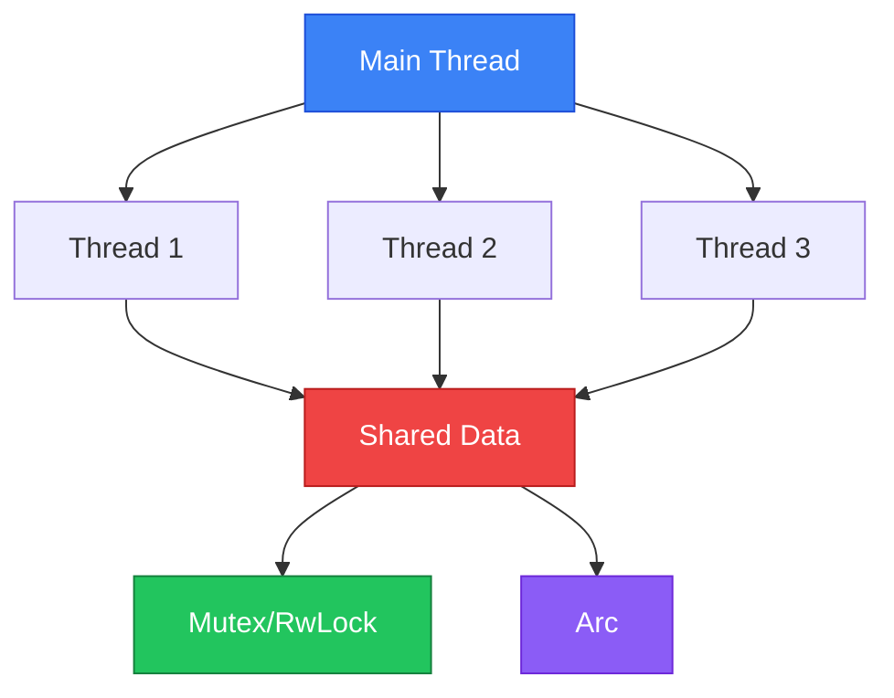

# Concurrency with Threads

Fearless Concurrency ใน Rust!



---

## 1. Creating Threads

### 1.1 Basic Thread

<RustPlayground>

```rust
use std::thread;
use std::time::Duration;

fn main() {
 // สร้าง thread ใหม่
 let handle = thread::spawn(|| {
 for i in 1..5 {
 println!("Thread: count {}", i);
 thread::sleep(Duration::from_millis(100));
 }
 });
 
 // Main thread ทำงานต่อ
 for i in 1..3 {
 println!("Main: count {}", i);
 thread::sleep(Duration::from_millis(100));
 }
 
 // รอ thread จบ
 handle.join().unwrap();
 println!("Done!");
}
```

</RustPlayground>

### 1.2 Multiple Threads

<RustPlayground>

```rust
use std::thread;

fn main() {
 let mut handles = vec![];
 
 for i in 0..5 {
 let handle = thread::spawn(move || {
 println!("Thread {} started", i);
 thread::sleep(std::time::Duration::from_millis(100));
 println!("Thread {} finished", i);
 i * 2 // Return value
 });
 handles.push(handle);
 }
 
 // รอทุก thread และเก็บผลลัพธ์
 let results: Vec<i32> = handles
 .into_iter()
 .map(|h| h.join().unwrap())
 .collect();
 
 println!("Results: {:?}", results);
}
```

</RustPlayground>

### 1.3 move Keyword

<RustPlayground>

```rust
use std::thread;

fn main() {
 let data = vec![1, 2, 3];
 
 // ต้องใช้ move เพื่อย้าย ownership ไปให้ thread
 let handle = thread::spawn(move || {
 println!("Data in thread: {:?}", data);
 });
 
 // data ถูก move แล้ว ใช้ตรงนี้ไม่ได้
 // println!("{:?}", data); // Error!
 
 handle.join().unwrap();
}
```

</RustPlayground>

---

## 2. Shared State

### 2.1 ปัญหาของ Shared Data

```rust
// This won't compile!
let counter = 0;
let handle = thread::spawn(|| {
 counter += 1; // Error: cannot borrow as mutable
});
```

### 2.2 Mutex (Mutual Exclusion)

<RustPlayground>

```rust
use std::sync::Mutex;

fn main() {
 let m = Mutex::new(5);
 
 {
 // lock() returns MutexGuard
 let mut num = m.lock().unwrap();
 *num = 6;
 println!("Changed value to: {}", *num);
 } // lock is released here
 
 println!("Final value: {:?}", m);
}
```

</RustPlayground>

### 2.3 Arc (Atomic Reference Counting)

<RustPlayground>

```rust
use std::sync::{Arc, Mutex};
use std::thread;

fn main() {
 // Arc allows shared ownership across threads
 let counter = Arc::new(Mutex::new(0));
 let mut handles = vec![];
 
 for _ in 0..10 {
 // Clone Arc (cheap, just increases ref count)
 let counter = Arc::clone(&counter);
 
 let handle = thread::spawn(move || {
 let mut num = counter.lock().unwrap();
 *num += 1;
 });
 handles.push(handle);
 }
 
 for handle in handles {
 handle.join().unwrap();
 }
 
 println!("Result: {}", *counter.lock().unwrap());
}
```

</RustPlayground>

### 2.4 Mutex vs RwLock

| Type | Read | Write |
|------|------|-------|
| `Mutex<T>` | One at a time | One at a time |
| `RwLock<T>` | Multiple readers | One writer |

<RustPlayground>

```rust
use std::sync::RwLock;

fn main() {
 let lock = RwLock::new(5);
 
 // Multiple readers
 {
 let r1 = lock.read().unwrap();
 let r2 = lock.read().unwrap();
 println!("Readers: {} and {}", *r1, *r2);
 }
 
 // Single writer
 {
 let mut w = lock.write().unwrap();
 *w += 1;
 println!("Writer changed to: {}", *w);
 }
 
 println!("Final: {:?}", lock);
}
```

</RustPlayground>

---

## 3. Message Passing

### 3.1 Channels

<RustPlayground>

```rust
use std::sync::mpsc; // Multi-producer, single-consumer
use std::thread;

fn main() {
 // สร้าง channel
 let (tx, rx) = mpsc::channel();
 
 thread::spawn(move || {
 let msg = String::from("hello from thread");
 tx.send(msg).unwrap();
 // msg ถูก move แล้ว ใช้ไม่ได้
 });
 
 // รับข้อความ
 let received = rx.recv().unwrap();
 println!("Received: {}", received);
}
```

</RustPlayground>

### 3.2 Multiple Messages

<RustPlayground>

```rust
use std::sync::mpsc;
use std::thread;
use std::time::Duration;

fn main() {
 let (tx, rx) = mpsc::channel();
 
 thread::spawn(move || {
 let messages = vec!["hello", "from", "the", "thread"];
 
 for msg in messages {
 tx.send(String::from(msg)).unwrap();
 thread::sleep(Duration::from_millis(100));
 }
 });
 
 // Receive loop
 for received in rx {
 println!("Got: {}", received);
 }
 
 println!("Channel closed");
}
```

</RustPlayground>

### 3.3 Multiple Producers

<RustPlayground>

```rust
use std::sync::mpsc;
use std::thread;
use std::time::Duration;

fn main() {
 let (tx, rx) = mpsc::channel();
 let tx2 = tx.clone(); // Clone transmitter
 
 thread::spawn(move || {
 let msgs = vec!["hi", "from", "thread 1"];
 for msg in msgs {
 tx.send(msg).unwrap();
 thread::sleep(Duration::from_millis(100));
 }
 });
 
 thread::spawn(move || {
 let msgs = vec!["more", "from", "thread 2"];
 for msg in msgs {
 tx2.send(msg).unwrap();
 thread::sleep(Duration::from_millis(100));
 }
 });
 
 for received in rx {
 println!("Got: {}", received);
 }
}
```

</RustPlayground>

---

## 4. Thread Safety Traits

### 4.1 Send and Sync

| Trait | Meaning |
|-------|---------|
| `Send` | Safe to transfer between threads |
| `Sync` | Safe to share reference between threads |

```rust
// Most types are Send + Sync
// These are NOT:
// - Rc<T> // Not Send, Not Sync (use Arc instead)
// - RefCell<T> // Not Sync (use Mutex instead)
// - *mut T // Raw pointers
```

### 4.2 Examples

| Type | Send | Sync |
|------|------|------|
| `i32` | Yes | Yes |
| `String` | Yes | Yes |
| `Rc<T>` | No | No |
| `Arc<T>` | Yes | Yes |
| `Mutex<T>` | Yes | Yes |
| `RefCell<T>` | Yes | No |

---

## 5. Common Patterns

### 5.1 Worker Pool

<RustPlayground>

```rust
use std::sync::{mpsc, Arc, Mutex};
use std::thread;

type Job = Box<dyn FnOnce() + Send + 'static>;

fn main() {
 let (tx, rx) = mpsc::channel::<Job>();
 let rx = Arc::new(Mutex::new(rx));
 
 // Create worker threads
 let mut handles = vec![];
 for id in 0..3 {
 let rx = Arc::clone(&rx);
 let handle = thread::spawn(move || {
 loop {
 let job = rx.lock().unwrap().recv();
 match job {
 Ok(job) => {
 println!("Worker {} got a job", id);
 job();
 }
 Err(_) => {
 println!("Worker {} shutting down", id);
 break;
 }
 }
 }
 });
 handles.push(handle);
 }
 
 // Send jobs
 for i in 0..5 {
 let job = Box::new(move || {
 println!("Processing job {}", i);
 });
 tx.send(job).unwrap();
 }
 
 // Close channel and wait
 drop(tx);
 for handle in handles {
 handle.join().unwrap();
 }
}
```

</RustPlayground>

### 5.2 Parallel Map

<RustPlayground>

```rust
use std::thread;

fn parallel_map<T, U, F>(data: Vec<T>, f: F) -> Vec<U>
where
 T: Send + 'static,
 U: Send + 'static,
 F: Fn(T) -> U + Send + Clone + 'static,
{
 data.into_iter()
 .map(|item| {
 let f = f.clone();
 thread::spawn(move || f(item))
 })
 .map(|handle| handle.join().unwrap())
 .collect()
}

fn main() {
 let numbers = vec![1, 2, 3, 4, 5];
 let squared = parallel_map(numbers, |x| x * x);
 println!("Squared: {:?}", squared);
}
```

</RustPlayground>

---

## 6. Async vs Threads

| Feature | Threads | Async |
|---------|---------|-------|
| Overhead | High (OS threads) | Low (tasks) |
| Scaling | Limited | Millions of tasks |
| CPU-bound | Good | Poor |
| I/O-bound | OK | Excellent |
| Blocking | OK | Avoid! |

---

## 7. Best Practices

### 7.1 Guidelines

| Practice | Description |
|----------|-------------|
| Prefer channels | Message passing over shared state |
| Use `Arc<Mutex<T>>` | For shared mutable state |
| Avoid deadlocks | Lock in consistent order |
| Use scoped threads | `std::thread::scope` for borrowing |
| Consider rayon | For easy parallelism |

### 7.2 Deadlock Prevention

```rust
// Potential deadlock
// Thread 1: lock A, then B
// Thread 2: lock B, then A

// Always lock in same order
// Thread 1: lock A, then B
// Thread 2: lock A, then B
```

::: pitfall
**ระวัง Deadlock!**
ถ้า Thread A ถือ Lock 1 แล้วรอ Lock 2
ส่วน Thread B ถือ Lock 2 แล้วรอ Lock 1
ทั้งคู่จะรอไปตลอดกาล!
**วิธีแก้:** พยายาม Lock เป็นลำดับเดียวกันเสมอ (Lock ordering)
:::

::: tip Mutex Poisoning
ถ้า Thread ที่ถือ Mutex Lock เกิด **Panic**, Lock นั้นจะกลายเป็น "Poisoned"
Thread อื่นที่พยายาม `lock()` จะได้ `Err` กลับมา (แต่เรามักจะ `unwrap()` เพื่อให้ panic ตามๆ กันไปเลย)
:::

---

## 8. สรุป

| Concept | Description |
|---------|-------------|
| `thread::spawn` | Create new thread |
| `join()` | Wait for thread |
| `move` | Transfer ownership to thread |
| `Mutex<T>` | Mutual exclusion lock |
| `Arc<T>` | Thread-safe reference counting |
| `RwLock<T>` | Multiple readers or single writer |
| `mpsc::channel` | Message passing channel |
| `Send` | Can transfer between threads |
| `Sync` | Can share reference between threads |

---

[กลับไปหน้า Advanced](/advanced/)
