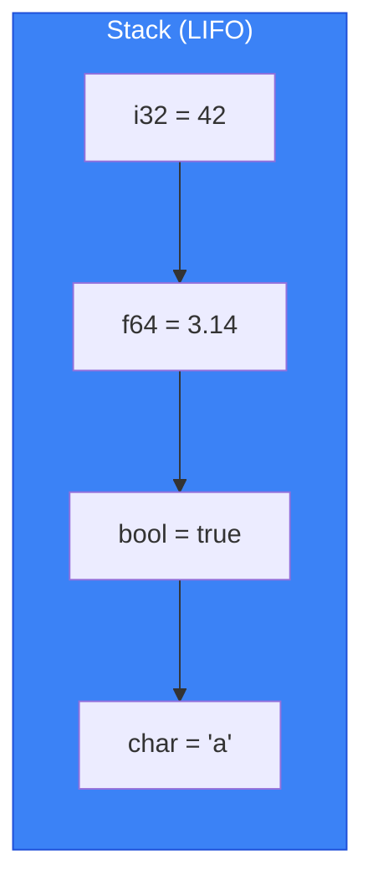
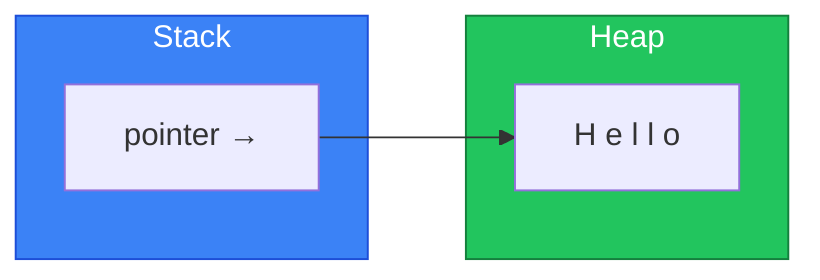

# Memory Model & Layout

เข้าใจว่า Rust จัดการ memory อย่างไร! 🧠

:::tip ทำไมต้องรู้เรื่อง Memory?
การเข้าใจ memory layout ช่วยให้เขียนโค้ดที่เร็วขึ้น ประหยัด memory และ debug ได้ง่ายขึ้น!
:::

---

## 1. Stack vs Heap

### 1.1 Stack



<RustPlayground>

```rust
fn main() {
    // ทุกอย่างนี้อยู่บน Stack
    let x: i32 = 42;      // 4 bytes
    let y: f64 = 3.14;    // 8 bytes
    let z: bool = true;   // 1 byte
    let c: char = 'a';    // 4 bytes (UTF-32)
    
    println!("x = {}, y = {}, z = {}, c = {}", x, y, z, c);
    
    // ขนาด types
    println!("\nSizes:");
    println!("  i32: {} bytes", std::mem::size_of::<i32>());
    println!("  f64: {} bytes", std::mem::size_of::<f64>());
    println!("  bool: {} bytes", std::mem::size_of::<bool>());
    println!("  char: {} bytes", std::mem::size_of::<char>());
}
```

</RustPlayground>

**ข้อดี Stack:**
- ✅ เร็วมาก (แค่ move pointer)
- ✅ Automatic cleanup (LIFO)
- ✅ CPU cache friendly

**ข้อจำกัด Stack:**
- ❌ ขนาดต้องรู้ตอน compile time
- ❌ มีขนาดจำกัด (default ~1-8 MB)

### 1.2 Heap



<RustPlayground>

```rust
fn main() {
    // String อยู่บน Heap
    let s = String::from("Hello");
    
    // Vec อยู่บน Heap
    let v = vec![1, 2, 3, 4, 5];
    
    // Box อยู่บน Heap
    let b = Box::new(42);
    
    println!("String: {}", s);
    println!("Vec: {:?}", v);
    println!("Box: {}", b);
    
    // ขนาดของ "pointer" บน Stack
    println!("\nStack sizes (pointers only):");
    println!("  String: {} bytes", std::mem::size_of::<String>());
    println!("  Vec<i32>: {} bytes", std::mem::size_of::<Vec<i32>>());
    println!("  Box<i32>: {} bytes", std::mem::size_of::<Box<i32>>());
}
```

</RustPlayground>

**ข้อดี Heap:**
- ✅ ขนาด dynamic (รู้ตอน runtime)
- ✅ ขนาดใหญ่ได้ (ขึ้นกับ RAM)
- ✅ สามารถ share ownership ได้ (Rc, Arc)

**ข้อจำกัด Heap:**
- ❌ ช้ากว่า Stack (ต้อง allocate/deallocate)
- ❌ อาจเกิด fragmentation

---

## 2. Type Layout

### 2.1 Primitive Types

<RustPlayground>

```rust
use std::mem::{size_of, align_of};

fn main() {
    println!("Type        | Size | Align");
    println!("------------|------|------");
    println!("i8          | {:4} | {:5}", size_of::<i8>(), align_of::<i8>());
    println!("i16         | {:4} | {:5}", size_of::<i16>(), align_of::<i16>());
    println!("i32         | {:4} | {:5}", size_of::<i32>(), align_of::<i32>());
    println!("i64         | {:4} | {:5}", size_of::<i64>(), align_of::<i64>());
    println!("i128        | {:4} | {:5}", size_of::<i128>(), align_of::<i128>());
    println!("isize       | {:4} | {:5}", size_of::<isize>(), align_of::<isize>());
    println!("f32         | {:4} | {:5}", size_of::<f32>(), align_of::<f32>());
    println!("f64         | {:4} | {:5}", size_of::<f64>(), align_of::<f64>());
    println!("bool        | {:4} | {:5}", size_of::<bool>(), align_of::<bool>());
    println!("char        | {:4} | {:5}", size_of::<char>(), align_of::<char>());
}
```

</RustPlayground>

### 2.2 Struct Layout

<RustPlayground>

```rust
use std::mem::{size_of, align_of};

// ลำดับ fields มีผลต่อ padding!
struct Unoptimal {
    a: u8,    // 1 byte + 3 padding
    b: u32,   // 4 bytes
    c: u8,    // 1 byte + 3 padding
}

struct Optimal {
    b: u32,   // 4 bytes (aligned)
    a: u8,    // 1 byte
    c: u8,    // 1 byte + 2 padding
}

fn main() {
    println!("Struct Layout Comparison:");
    println!("Unoptimal: {} bytes, align {}", 
        size_of::<Unoptimal>(), align_of::<Unoptimal>());
    println!("Optimal: {} bytes, align {}", 
        size_of::<Optimal>(), align_of::<Optimal>());
}
```

</RustPlayground>

:::tip เรียงลำดับ fields ให้ดี! 📐
เรียงจาก field ใหญ่ → เล็ก เพื่อลด padding
:::

### 2.3 repr Attributes

<RustPlayground>

```rust
use std::mem::size_of;

// Default Rust representation
struct RustRepr {
    a: u8,
    b: u32,
    c: u8,
}

// C-compatible representation
#[repr(C)]
struct CRepr {
    a: u8,
    b: u32,
    c: u8,
}

// Packed (no padding)
#[repr(packed)]
struct PackedRepr {
    a: u8,
    b: u32,
    c: u8,
}

fn main() {
    println!("RustRepr: {} bytes", size_of::<RustRepr>());
    println!("CRepr: {} bytes", size_of::<CRepr>());
    println!("PackedRepr: {} bytes", size_of::<PackedRepr>());
}
```

</RustPlayground>

| repr | Description | Use Case |
|------|-------------|----------|
| (default) | Rust optimizes layout | General use |
| `#[repr(C)]` | C-compatible layout | FFI |
| `#[repr(packed)]` | No padding | Network/Binary formats |
| `#[repr(align(N))]` | Minimum alignment | Cache alignment |

---

## 3. Enum Layout

### 3.1 Basic Enums

<RustPlayground>

```rust
use std::mem::size_of;

enum Simple {
    A,
    B,
    C,
}

enum WithData {
    Nothing,
    Number(i32),
    Text(String),
}

fn main() {
    println!("Simple enum: {} bytes", size_of::<Simple>());
    println!("WithData enum: {} bytes", size_of::<WithData>());
    
    // Discriminant + largest variant
    println!("\nBreakdown:");
    println!("  discriminant: ~1-8 bytes");
    println!("  String (largest): {} bytes", size_of::<String>());
}
```

</RustPlayground>

### 3.2 Niche Optimization

<RustPlayground>

```rust
use std::mem::size_of;

fn main() {
    // Option<&T> มีขนาดเท่ากับ &T!
    // เพราะ null pointer ใช้เป็น None ได้
    println!("&i32: {} bytes", size_of::<&i32>());
    println!("Option<&i32>: {} bytes", size_of::<Option<&i32>>());
    
    // Option<Box<T>> ก็เช่นกัน
    println!("\nBox<i32>: {} bytes", size_of::<Box<i32>>());
    println!("Option<Box<i32>>: {} bytes", size_of::<Option<Box<i32>>>());
    
    // NonZero types ก็ใช้ niche
    println!("\nstd::num::NonZeroU32: {} bytes", 
        size_of::<std::num::NonZeroU32>());
    println!("Option<NonZeroU32>: {} bytes", 
        size_of::<Option<std::num::NonZeroU32>>());
}
```

</RustPlayground>

:::tip Niche Optimization 🎯
Rust ฉลาดมาก! รู้ว่าบาง type มี "invalid values" ที่ไม่ถูกใช้ (เช่น null pointer) แล้วเอามาใช้เป็น discriminant แทน ทำให้ `Option<&T>` ไม่มี overhead!
:::

---

## 4. Zero-Sized Types (ZST)

<RustPlayground>

```rust
use std::mem::size_of;

// Zero-sized types
struct Empty;
struct Marker;
struct PhantomLike<T>(std::marker::PhantomData<T>);

fn main() {
    println!("(): {} bytes", size_of::<()>());
    println!("Empty: {} bytes", size_of::<Empty>());
    println!("Marker: {} bytes", size_of::<Marker>());
    println!("PhantomLike<i32>: {} bytes", size_of::<PhantomLike<i32>>());
    
    // Vec ของ ZST ไม่ allocate!
    let markers: Vec<Marker> = vec![Marker; 1_000_000];
    println!("\nVec of 1M markers: {} bytes capacity", 
        markers.capacity() * size_of::<Marker>());
}
```

</RustPlayground>

**Use Cases for ZST:**
- Type-level markers (PhantomData)
- Distinguishing types at compile time
- Zero-cost abstractions

---

## 5. Fat Pointers

<RustPlayground>

```rust
use std::mem::size_of;

fn main() {
    // Thin pointer (1 pointer)
    println!("&i32: {} bytes", size_of::<&i32>());
    println!("&String: {} bytes", size_of::<&String>());
    
    // Fat pointer (2 pointers)
    println!("\n&[i32]: {} bytes (ptr + len)", size_of::<&[i32]>());
    println!("&str: {} bytes (ptr + len)", size_of::<&str>());
    println!("&dyn std::fmt::Debug: {} bytes (ptr + vtable)", 
        size_of::<&dyn std::fmt::Debug>());
    
    // Box ก็เช่นกัน
    println!("\nBox<i32>: {} bytes", size_of::<Box<i32>>());
    println!("Box<[i32]>: {} bytes", size_of::<Box<[i32]>>());
    println!("Box<dyn std::fmt::Debug>: {} bytes", 
        size_of::<Box<dyn std::fmt::Debug>>());
}
```

</RustPlayground>

| Type | Size | Contents |
|------|------|----------|
| `&T` | 1 pointer | data pointer |
| `&[T]` | 2 pointers | data pointer + length |
| `&str` | 2 pointers | data pointer + length |
| `&dyn Trait` | 2 pointers | data pointer + vtable |

---

## 6. Drop Order

<RustPlayground>

```rust
struct Droppable(i32);

impl Drop for Droppable {
    fn drop(&mut self) {
        println!("Dropping {}", self.0);
    }
}

fn main() {
    println!("Creating...");
    let a = Droppable(1);
    let b = Droppable(2);
    let c = Droppable(3);
    
    println!("Scope ends...");
    // Drop order: reverse of declaration (LIFO)
    // c, b, a
}
```

</RustPlayground>

---

## 7. สรุป

| Concept | Description |
|---------|-------------|
| Stack | Fast, fixed-size, LIFO |
| Heap | Dynamic size, slower |
| Alignment | Memory address divisibility |
| Padding | Extra bytes for alignment |
| `#[repr(C)]` | C-compatible layout |
| Niche | Optimization for Option |
| ZST | Zero-sized types |
| Fat pointer | Pointer + metadata |

---

[บทถัดไป: Interior Mutability](/advanced/interior-mutability)
