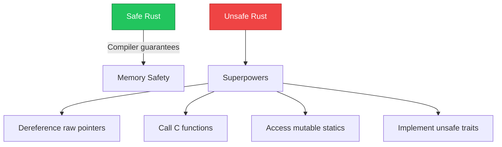

# Unsafe Rust

ปลดล็อคพลังเต็มของ Rust - แต่ความรับผิดชอบอยู่ที่คุณ!



:::warning ระวัง!
`unsafe` ไม่ได้หมายความว่า code ผิด แต่หมายความว่า **compiler ไม่รับประกัน** memory safety ให้คุณ คุณต้องรับผิดชอบเอง!
:::

---

## 1. Unsafe Superpowers

### 1.1 สิ่งที่ทำได้ใน unsafe

| Superpower | Description |
|------------|-------------|
| Dereference raw pointers | `*const T`, `*mut T` |
| Call unsafe functions | C functions, intrinsics |
| Access mutable statics | `static mut` variables |
| Implement unsafe traits | `Send`, `Sync` manually |
| Access union fields | Union field access |

### 1.2 สิ่งที่ยังคงถูกตรวจสอบ

| Still checked | Description |
|---------------|-------------|
| Borrow checker | Still active inside unsafe |
| Type checking | Types must match |
| Bounds checking | Array bounds (unless raw ptr) |

---

## 2. Raw Pointers

### 2.1 Creating Raw Pointers

<RustPlayground>

```rust
fn main() {
    let x = 5;
    
    // สร้าง raw pointer จาก reference
    let ptr: *const i32 = &x;
    let mut_ptr: *mut i32 = &x as *const i32 as *mut i32;
    
    println!("Pointer: {:?}", ptr);
    println!("Address: {:p}", ptr);
    
    // Safe part: creating pointers is safe
    // Unsafe part: dereferencing them
    unsafe {
        println!("Value: {}", *ptr);
    }
}
```

</RustPlayground>

### 2.2 Raw Pointer Operations

<RustPlayground>

```rust
fn main() {
    let mut value = 42;
    let ptr: *mut i32 = &mut value;
    
    unsafe {
        // Read value
        println!("Value: {}", *ptr);
        
        // Write value
        *ptr = 100;
        println!("New value: {}", *ptr);
        
        // Pointer arithmetic
        let arr = [1, 2, 3, 4, 5];
        let arr_ptr: *const i32 = arr.as_ptr();
        
        println!("First: {}", *arr_ptr);
        println!("Second: {}", *arr_ptr.add(1));
        println!("Third: {}", *arr_ptr.offset(2));
    }
    
    println!("Final value: {}", value);
}
```

</RustPlayground>

### 2.3 Null Pointers

<RustPlayground>

```rust
use std::ptr;

fn main() {
    // Create null pointer
    let null_ptr: *const i32 = ptr::null();
    let null_mut_ptr: *mut i32 = ptr::null_mut();
    
    // Check for null
    println!("Is null: {}", null_ptr.is_null());
    
    // DANGER: dereferencing null is UB!
    // unsafe { *null_ptr }  // Undefined Behavior!
}
```

</RustPlayground>

---

## 3. Unsafe Functions

### 3.1 Calling Unsafe Functions

<RustPlayground>

```rust
unsafe fn dangerous() {
    println!("This is dangerous!");
}

fn main() {
    // Must wrap in unsafe block
    unsafe {
        dangerous();
    }
}
```

</RustPlayground>

### 3.2 Safe Abstraction Over Unsafe

<RustPlayground>

```rust
fn split_at_mut(slice: &mut [i32], mid: usize) -> (&mut [i32], &mut [i32]) {
    let len = slice.len();
    let ptr = slice.as_mut_ptr();
    
    assert!(mid <= len);
    
    unsafe {
        (
            std::slice::from_raw_parts_mut(ptr, mid),
            std::slice::from_raw_parts_mut(ptr.add(mid), len - mid),
        )
    }
}

fn main() {
    let mut arr = [1, 2, 3, 4, 5];
    let (left, right) = split_at_mut(&mut arr, 2);
    
    println!("Left: {:?}", left);   // [1, 2]
    println!("Right: {:?}", right); // [3, 4, 5]
}
```

</RustPlayground>

---

## 4. Static Variables

### 4.1 Mutable Statics

<RustPlayground>

```rust
static mut COUNTER: u32 = 0;

fn increment() {
    unsafe {
        COUNTER += 1;
    }
}

fn main() {
    increment();
    increment();
    increment();
    
    unsafe {
        println!("Counter: {}", COUNTER);
    }
}
```

</RustPlayground>

:::danger Mutable statics are dangerous!
ใช้ `Mutex` หรือ `AtomicU32` แทนใน production code:

```rust
use std::sync::atomic::{AtomicU32, Ordering};

static COUNTER: AtomicU32 = AtomicU32::new(0);

fn increment() {
    COUNTER.fetch_add(1, Ordering::SeqCst);
}
```
:::

---

## 5. FFI (Foreign Function Interface)

### 5.1 Calling C Functions

```rust
// Link with C library
extern "C" {
    fn abs(input: i32) -> i32;
    fn strlen(s: *const i8) -> usize;
}

fn main() {
    unsafe {
        println!("abs(-5) = {}", abs(-5));
    }
}
```

### 5.2 Exposing Rust to C

```rust
// Can be called from C code
#[no_mangle]
pub extern "C" fn rust_function(x: i32) -> i32 {
    x * 2
}
```

### 5.3 C String Handling

<RustPlayground>

```rust
use std::ffi::{CStr, CString};

fn main() {
    // Rust String -> C String
    let rust_string = "Hello from Rust";
    let c_string = CString::new(rust_string).unwrap();
    let ptr = c_string.as_ptr();
    
    // C String -> Rust &str
    unsafe {
        let c_str = CStr::from_ptr(ptr);
        let rust_str = c_str.to_str().unwrap();
        println!("Got back: {}", rust_str);
    }
}
```

</RustPlayground>

---

## 6. Unsafe Traits

### 6.1 Send and Sync

```rust
// Mark a type as safe to send between threads
unsafe impl Send for MyType {}

// Mark a type as safe to share references between threads
unsafe impl Sync for MyType {}
```

### 6.2 Custom Unsafe Trait

<RustPlayground>

```rust
unsafe trait Zeroable {
    fn zeroed() -> Self;
}

unsafe impl Zeroable for i32 {
    fn zeroed() -> Self {
        0
    }
}

unsafe impl Zeroable for f64 {
    fn zeroed() -> Self {
        0.0
    }
}

fn create_zeroed<T: Zeroable>() -> T {
    T::zeroed()
}

fn main() {
    let x: i32 = create_zeroed();
    let y: f64 = create_zeroed();
    println!("x = {}, y = {}", x, y);
}
```

</RustPlayground>

---

## 7. Union Types

<RustPlayground>

```rust
#[repr(C)]
union IntOrFloat {
    i: i32,
    f: f32,
}

fn main() {
    let u = IntOrFloat { i: 42 };
    
    unsafe {
        // Reading union field requires unsafe
        println!("As int: {}", u.i);
        println!("As float: {}", u.f);  // Reinterpret bits
    }
}
```

</RustPlayground>

---

## 8. Common Patterns

### 8.1 Inline Assembly

```rust
#[cfg(target_arch = "x86_64")]
fn main() {
    let x: u64;
    unsafe {
        std::arch::asm!(
            "mov {}, 42",
            out(reg) x,
        );
    }
    println!("x = {}", x);
}
```

### 8.2 Memory Layout Control

<RustPlayground>

```rust
use std::mem;

#[repr(C)]
struct CStruct {
    a: u8,
    b: u32,
    c: u8,
}

#[repr(packed)]
struct PackedStruct {
    a: u8,
    b: u32,
    c: u8,
}

fn main() {
    println!("CStruct size: {}", mem::size_of::<CStruct>());
    println!("PackedStruct size: {}", mem::size_of::<PackedStruct>());
    println!("CStruct align: {}", mem::align_of::<CStruct>());
}
```

</RustPlayground>

---

## 9. Best Practices

### 9.1 When to Use Unsafe

| Use Case | Example |
|----------|---------|
| FFI | Calling C libraries |
| Performance | Skip bounds checks |
| Hardware access | Memory-mapped I/O |
| Implement safe abstractions | `Vec`, `String` internals |

### 9.2 Guidelines

| Do | Don't |
|-----|-------|
| Minimize unsafe scope | Large unsafe blocks |
| Document invariants | Assume safety |
| Wrap in safe API | Expose raw pointers |
| Use existing safe abstractions | Reinvent the wheel |

### 9.3 Unsafe Code Review Checklist

1. ✅ Is unsafe actually needed?
2. ✅ Are invariants documented?
3. ✅ Is the unsafe block minimal?
4. ✅ Are raw pointers valid?
5. ✅ Is there potential for UB?
6. ✅ Is memory properly freed?

---

## 10. สรุป

| Concept | Description |
|---------|-------------|
| `unsafe { }` | Unsafe block |
| `*const T` | Immutable raw pointer |
| `*mut T` | Mutable raw pointer |
| `unsafe fn` | Unsafe function |
| `extern "C"` | FFI declaration |
| `static mut` | Mutable global |
| `union` | Union type |
| `unsafe impl` | Unsafe trait impl |

---

[กลับไปหน้า Advanced](/advanced/)
