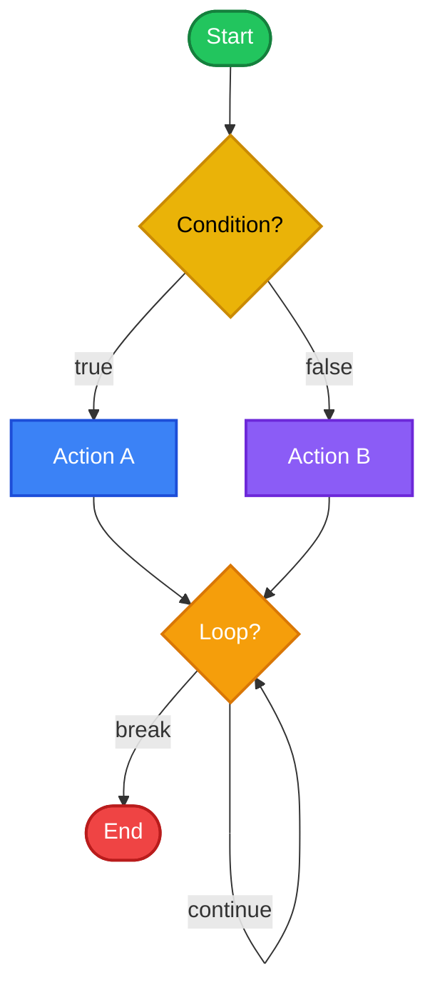

# Control Flow

ควบคุมการไหลของโปรแกรมด้วย if, loop, และ match!



## 1. If Expressions

### 1.1 If พื้นฐาน

<RustPlayground>

```rust
fn main() {
 let number = 7;
 
 // if พื้นฐาน
 if number > 5 {
 println!("มากกว่า 5");
 }
 
 // if-else
 if number > 10 {
 println!("มากกว่า 10");
 } else {
 println!("10 หรือน้อยกว่า");
 }
}
```

</RustPlayground>

### 1.2 If-Else If-Else Chain

<RustPlayground>

```rust
fn main() {
 let number = 7;
 
 if number > 10 {
 println!("มากกว่า 10");
 } else if number > 5 {
 println!("มากกว่า 5 แต่ไม่เกิน 10");
 } else if number > 0 {
 println!("มากกว่า 0 แต่ไม่เกิน 5");
 } else {
 println!("0 หรือน้อยกว่า");
 }
}
```

</RustPlayground>

### 1.3 If เป็น Expression

<RustPlayground>

```rust
fn main() {
 let number = 7;
 
 // if เป็น expression, ใช้กับ let ได้!
 let status = if number > 0 { "positive" } else { "non-positive" };
 println!("Number is {}", status);
 
 // ใช้สร้างค่าตามเงื่อนไข
 let abs_value = if number >= 0 { number } else { -number };
 println!("Absolute value: {}", abs_value);
 
 // หลายเงื่อนไข
 let category = if number > 10 {
 "large"
 } else if number > 0 {
 "small"
 } else {
 "zero or negative"
 };
 println!("Category: {}", category);
}
```

</RustPlayground>

### 1.4 Common Errors

:::danger Error: Expected bool, found integer

```rust
let number = 5;
if number { // ERROR!
 println!("truthy");
}
```

**เหตุผล:** Rust ไม่มี "truthy" values เหมือน JS/Python

**วิธีแก้:**
```rust
if number != 0 { ... } // explicit comparison
if number > 0 { ... } // 
```
:::

:::danger Error: if/else types mismatch

```rust
let x = if true { 5 } else { "hello" }; // ERROR!
```

**วิธีแก้:** ทั้ง if และ else ต้อง return type เดียวกัน
```rust
let x = if true { 5 } else { 10 }; // 
```
:::

### 1.5 เปรียบเทียบกับภาษาอื่น

| ภาษา | Truthy Values |
|------|---------------|
| **Rust** | เฉพาะ `true` เท่านั้น |
| **JavaScript** | ทุกอย่างยกเว้น `false`, `0`, `""`, `null`, `undefined`, `NaN` |
| **Python** | ทุกอย่างยกเว้น `False`, `0`, `""`, `None`, `[]`, `{}` |

---

## 2. Loops

### 2.1 loop (Infinite Loop)

<RustPlayground>

```rust
fn main() {
 let mut count = 0;
 
 // loop วนไปเรื่อยๆ จนกว่า break
 loop {
 count += 1;
 println!("count = {}", count);
 
 if count >= 3 {
 break; // ออกจาก loop
 }
 }
 
 println!("Loop ended!");
}
```

</RustPlayground>

### 2.2 loop กับ Return Value

<RustPlayground>

```rust
fn main() {
 let mut counter = 0;
 
 // loop สามารถ return ค่าได้!
 let result = loop {
 counter += 1;
 
 if counter == 10 {
 break counter * 2; // return ค่า
 }
 };
 
 println!("Result: {}", result); // 20
}
```

</RustPlayground>

::: tip Loop เป็น Expression
เห็นไหมว่า `loop` สามารถ return ค่าได้! นี่เป็นฟีเจอร์ที่เจ๋งมากเมื่อต้องการ "Retry จนกว่าจะได้ค่า" (เช่น retry connection)
:::

### 2.3 Loop Labels

<RustPlayground>

```rust
fn main() {
 let mut count = 0;
 
 // Label loop ด้วย 'outer
 'outer: loop {
 println!("count = {}", count);
 let mut remaining = 10;
 
 loop {
 println!(" remaining = {}", remaining);
 
 if remaining == 9 {
 break; // break inner loop
 }
 if count == 2 {
 break 'outer; // break outer loop
 }
 remaining -= 1;
 }
 
 count += 1;
 }
 
 println!("End count = {}", count);
}
```

</RustPlayground>

### 2.4 while Loop

<RustPlayground>

```rust
fn main() {
 let mut number = 3;
 
 // while loop - วนจนกว่า condition เป็น false
 while number != 0 {
 println!("{}!", number);
 number -= 1;
 }
 
 println!("LIFTOFF!");
}
```

</RustPlayground>

### 2.5 for Loop

#### Iterate over Collection

<RustPlayground>

```rust
fn main() {
 let a = [10, 20, 30, 40, 50];
 
 // for loop - iterate collection
 for element in a {
 println!("value: {}", element);
 }
}
```

</RustPlayground>

#### Iterate with Range

<RustPlayground>

```rust
fn main() {
 // Range: 1..4 = [1, 2, 3]
 for number in 1..4 {
 println!("{}!", number);
 }
 
 // Inclusive range: 1..=4 = [1, 2, 3, 4]
 println!("---");
 for number in 1..=4 {
 println!("{}!", number);
 }
 
 // Reverse
 println!("---");
 for number in (1..4).rev() {
 println!("{}!", number);
 }
}
```

</RustPlayground>

#### Iterate with Index

<RustPlayground>

```rust
fn main() {
 let fruits = ["apple", "banana", "cherry"];
 
 // enumerate() gives (index, value)
 for (index, fruit) in fruits.iter().enumerate() {
 println!("{}: {}", index, fruit);
 }
}
```

</RustPlayground>

### 2.6 Loop Comparison

| Loop | ใช้เมื่อ |
|------|---------|
| `loop` | ไม่รู้จะวนกี่รอบ, ต้องการ return value |
| `while` | มี condition ที่ต้องตรวจสอบ |
| `for` | Iterate collection หรือ range |

---

## 3. Match Expression

### 3.1 Basic Match

<RustPlayground>

```rust
fn main() {
 let number = 3;
 
 // match = pattern matching (เหมือน switch แต่ powerful กว่า)
 match number {
 1 => println!("One!"),
 2 => println!("Two!"),
 3 => println!("Three!"),
 _ => println!("Something else!"), // _ = default
 }
}
```

</RustPlayground>

### 3.2 Match กับ Multiple Patterns

<RustPlayground>

```rust
fn main() {
 let number = 4;
 
 match number {
 1 | 2 | 3 => println!("One, Two, or Three!"), // OR patterns
 4..=6 => println!("Four to Six!"), // Range
 _ => println!("Something else!"),
 }
}
```

</RustPlayground>

### 3.3 Match กับ Binding

<RustPlayground>

```rust
fn main() {
 let number = 5;
 
 match number {
 n if n < 0 => println!("{} is negative", n), // Guard
 n if n == 0 => println!("Zero!"),
 n => println!("{} is positive", n), // Catch-all with binding
 }
}
```

</RustPlayground>

### 3.4 Match เป็น Expression

<RustPlayground>

```rust
fn main() {
 let number = 7;
 
 // match return ค่าได้
 let description = match number {
 1 => "one",
 2 => "two",
 3 => "three",
 _ => "many",
 };
 
 println!("Number is: {}", description);
}
```

</RustPlayground>

### 3.5 Match กับ Enum

<RustPlayground>

```rust
enum Coin {
 Penny,
 Nickel,
 Dime,
 Quarter,
}

fn value_in_cents(coin: Coin) -> u8 {
 match coin {
 Coin::Penny => 1,
 Coin::Nickel => 5,
 Coin::Dime => 10,
 Coin::Quarter => 25,
 }
}

fn main() {
 let coin = Coin::Dime;
 println!("Value: {} cents", value_in_cents(coin));
}
```

</RustPlayground>

### 3.6 Match กับ Option

<RustPlayground>

```rust
fn main() {
 let some_number = Some(5);
 let no_number: Option<i32> = None;
 
 // Match Option
 match some_number {
 Some(n) => println!("Got: {}", n),
 None => println!("Nothing!"),
 }
 
 match no_number {
 Some(n) => println!("Got: {}", n),
 None => println!("Nothing!"),
 }
}
```

</RustPlayground>

---

## 4. If Let & While Let

### 4.1 If Let

<RustPlayground>

```rust
fn main() {
 let some_value = Some(3);
 
 // แบบยาว: match
 match some_value {
 Some(n) => println!("Got: {}", n),
 _ => (), // ต้องมี _ แม้ไม่ทำอะไร
 }
 
 // แบบสั้น: if let
 if let Some(n) = some_value {
 println!("Got: {}", n);
 }
 
 // if let กับ else
 if let Some(n) = some_value {
 println!("Got: {}", n);
 } else {
 println!("Nothing!");
 }
}
```

</RustPlayground>

### 4.2 While Let

<RustPlayground>

```rust
fn main() {
 let mut stack = Vec::new();
 
 stack.push(1);
 stack.push(2);
 stack.push(3);
 
 // while let - วนจน pop() return None
 while let Some(top) = stack.pop() {
 println!("{}", top);
 }
 
 println!("Stack is empty!");
}
```

</RustPlayground>

### 4.3 เปรียบเทียบ match vs if let

| | match | if let |
|---|-------|--------|
| ใช้เมื่อ | ต้องการ handle ทุก case | สนใจแค่ 1 case |
| Exhaustive | Yes (ต้องครบ) | No |
| Compiler check | บังคับ handle ทุก case | ไม่บังคับ |

---

## 5. สรุป

| Construct | ใช้เมื่อ | ตัวอย่าง |
|-----------|---------|---------|
| `if` | ตรวจสอบเงื่อนไขเดียว | `if x > 0 { ... }` |
| `if-else` | 2 ทางเลือก | `if x > 0 { ... } else { ... }` |
| `loop` | วน infinite | `loop { ... break; }` |
| `while` | วนตาม condition | `while x < 10 { ... }` |
| `for` | วน collection/range | `for x in 1..10 { ... }` |
| `match` | Pattern matching | `match x { 1 => ..., _ => ... }` |
| `if let` | Match 1 pattern | `if let Some(n) = x { ... }` |

---

[บทถัดไป: Ownership](/beginner/ownership)
