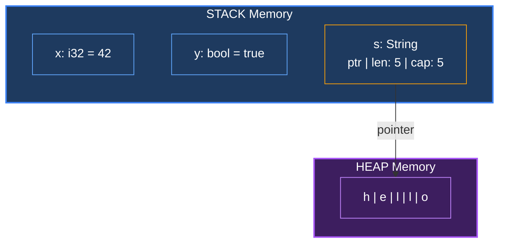
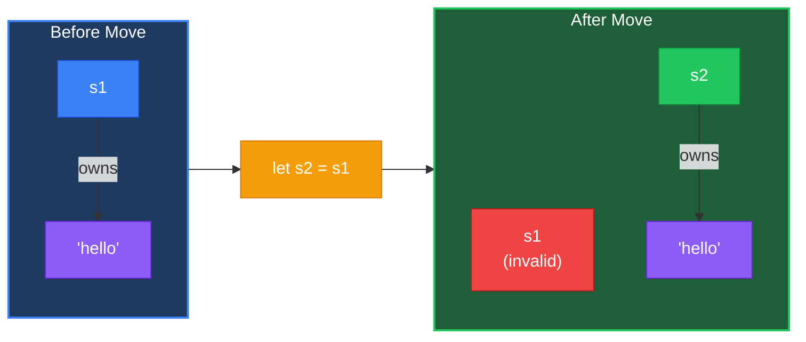
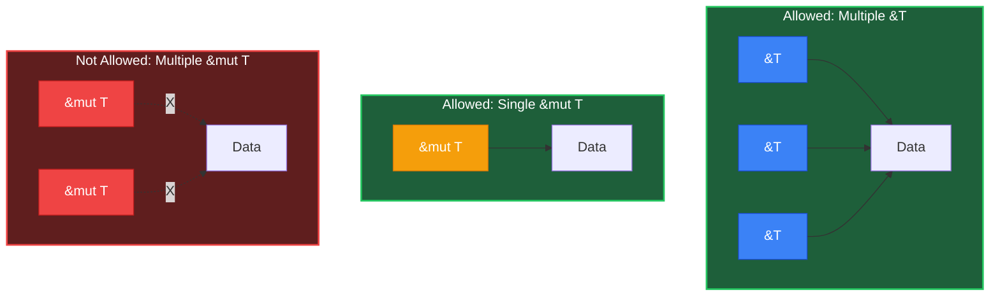

# Ownership

**Ownership** คือหัวใจสำคัญของ Rust! ถ้าเข้าใจเรื่องนี้ คุณเข้าใจ Rust ไปครึ่งนึงแล้ว!

:::tip ทำไม Ownership ถึงเจ๋ง? 
Rust ปลอดภัยต่อ memory **โดยไม่ต้องใช้ Garbage Collector!** นั่นหมายความว่าเร็วเหมือน C/C++ แต่ปลอดภัยเหมือน Java/Python!
:::

## 1. หลักการพื้นฐาน

### 1.1 กฎ 3 ข้อของ Ownership

กฎง่ายๆ แค่ 3 ข้อ จำให้ขึ้นใจ!

1. **ทุกค่ามีเจ้าของ (owner) เพียงคนเดียว**
 ```rust
 let s = String::from("hello"); // s เป็นเจ้าของ "hello"
 ```

2. **เมื่อ owner ออกจาก scope ค่าจะถูกทิ้ง (dropped)**
 ```rust
 {
 let s = String::from("hello");
 } // <- s ออกจาก scope, memory ถูก free อัตโนมัติ!
 ```

3. **ค่าหนึ่งมี owner ได้แค่คนเดียวในเวลาใดเวลาหนึ่ง**
 ```rust
 let s1 = String::from("hello");
 let s2 = s1; // s2 เป็น owner ใหม่, s1 ตกงานแล้ว!
 ```

:::tip เปรียบเทียบกับชีวิตจริง 
ลองนึกถึง **กุญแจรถ** นะ:
- กุญแจมี **เจ้าของ** คนเดียว (ใครถืออยู่)
- ถ้า**ให้คนอื่น** = เราใช้ไม่ได้แล้ว (move) 
- ถ้าอยาก**ใช้ร่วมกัน** = ให้ถ่ายรูปกุญแจไป (borrow)
- ถ้าอยากได้**คนละดอก** = ก๊อปปี้กุญแจมา (clone)

เห็นไหม ไม่ยากเลย! 
:::

### 1.2 ทำไมต้องมี Ownership?

#### ปัญหาในภาษาอื่น (ที่ Rust แก้ได้!)

| ปัญหา | C/C++ | Java/Python | Rust |
|-------|-------|-------------|------|
| Memory leak | ลืม free | GC ช้า | ไม่มี! (auto drop) |
| Dangling pointer | มี | ไม่มี | ไม่มี! (compile error) |
| Double free | มี | ไม่มี | ไม่มี! (compile error) |
| Race condition | มี | มี | ไม่มี! (compile error) |

#### Rust แก้ปัญหายังไง?

<RustPlayground>

```rust
fn main() {
 // ตัวอย่าง: ป้องกัน double free
 let s1 = String::from("hello");
 let s2 = s1; // s1 ถูก "move" ไป s2
 
 // println!("{}", s1); // Compile error!
 println!("{}", s2); // OK
}
```

</RustPlayground>

---

## 2. Stack vs Heap

### 2.1 Stack Memory

#### คุณสมบัติของ Stack
- **LIFO** (Last In, First Out)
- **เร็วมาก** - แค่เลื่อน pointer
- **ขนาดคงที่** - รู้ตอน compile

#### Types ที่อยู่บน Stack

<RustPlayground>

```rust
fn main() {
 // ทุกอย่างนี้อยู่บน Stack
 let x: i32 = 42; // 4 bytes
 let y: f64 = 3.14; // 8 bytes
 let z: bool = true; // 1 byte
 let c: char = 'A'; // 4 bytes
 let arr: [i32; 3] = [1, 2, 3]; // 12 bytes
 
 println!("x={}, y={}, z={}, c={}", x, y, z, c);
 println!("arr={:?}", arr);
}
```

</RustPlayground>

### 2.2 Heap Memory

#### คุณสมบัติของ Heap
- **ขนาดไม่คงที่** - เปลี่ยนได้ runtime
- **ช้ากว่า Stack** - ต้อง allocate/deallocate
- **ต้องจัดการ** - Rust จัดการให้ผ่าน ownership

#### Types ที่อยู่บน Heap

<RustPlayground>

```rust
fn main() {
 // เหล่านี้อยู่บน Heap
 let s = String::from("hello"); // String (growable)
 let v = vec![1, 2, 3]; // Vec (growable array)
 let b = Box::new(42); // Box (heap-allocated)
 
 println!("s={}, v={:?}, b={}", s, v, b);
}
```

</RustPlayground>

### 2.3 เปรียบเทียบ Stack vs Heap

| คุณสมบัติ | Stack | Heap |
|----------|-------|------|
| ความเร็ว | เร็วมาก | ช้ากว่า |
| ขนาด | คงที่ (รู้ตอน compile) | เปลี่ยนได้ (runtime) |
| การจัดการ | อัตโนมัติ | ผ่าน ownership |
| Copy | ราคาถูก (bitwise) | ราคาแพง (clone) |
| ตัวอย่าง | `i32`, `bool`, `[i32; 5]` | `String`, `Vec`, `Box` |

### 2.4 Memory Layout Diagram



**อธิบาย:**
- `x` และ `y` อยู่บน **Stack** โดยตรง (ขนาดคงที่)
- `s` (String) มี 3 ส่วน: **pointer**, **length**, **capacity**
- pointer ชี้ไปที่ข้อมูลจริงบน **Heap**

---

## 3. Move Semantics

### 3.1 Move คืออะไร?

Move คือการย้าย ownership จากตัวแปรหนึ่งไปอีกตัวหนึ่ง

<RustPlayground>

```rust
fn main() {
 let s1 = String::from("hello");
 let s2 = s1; // s1 ถูก "move" ไปยัง s2
 
 // s1 ใช้ไม่ได้แล้ว!
 // println!("{}", s1); // ERROR: use of moved value
 
 // s2 ใช้ได้
 println!("{}", s2); // OK
}
```

</RustPlayground>



### 3.2 ทำไมต้อง Move?

:::info ปัญหา Double Free

```
ถ้าทั้ง s1 และ s2 ชี้ไปที่ memory เดียวกัน:

s1 
 > "hello" บน heap
s2 

เมื่อออกจาก scope:
1. s2 ออก -> free "hello" 
2. s1 ออก -> free "hello" อีกครั้ง CRASH!
```

**Rust แก้ปัญหานี้ด้วย Move:**
```
หลังจาก let s2 = s1;

s1 X (invalidated)

s2 > "hello" บน heap

มี owner เดียว = free แค่ครั้งเดียว = ปลอดภัย!
```
:::

### 3.3 Move กับ Functions

<RustPlayground>

```rust
fn main() {
 let s = String::from("hello");
 
 takes_ownership(s); // s ถูก move เข้าไปใน function
 
 // println!("{}", s); // ERROR: s ใช้ไม่ได้แล้ว
 
 let x = 5;
 makes_copy(x); // x ถูก copy (เพราะเป็น i32)
 
 println!("x = {}", x); // OK: x ยังใช้ได้
}

fn takes_ownership(s: String) {
 println!("{}", s);
} // s หมด scope, memory ถูก free

fn makes_copy(x: i32) {
 println!("{}", x);
} // x หมด scope, ไม่มี effect (เพราะ copy)
```

</RustPlayground>

### 3.4 เปรียบเทียบกับภาษาอื่น

| ภาษา | พฤติกรรม |
|------|----------|
| **Rust** | Move by default (safe) |
| **C++** | Copy by default (slow), must use std::move |
| **Java** | Reference copy (shallow), GC handles cleanup |
| **Python** | Reference copy (shallow), GC handles cleanup |
| **Go** | Depends on type, GC handles cleanup |

---

## 4. Clone (Deep Copy)

### 4.1 เมื่อไหร่ใช้ Clone?

เมื่อต้องการ copy ข้อมูลทั้งหมด และใช้ทั้งสองตัว

<RustPlayground>

```rust
fn main() {
 let s1 = String::from("hello");
 let s2 = s1.clone(); // Deep copy ข้อมูลทั้งหมด
 
 // ทั้งคู่ใช้ได้!
 println!("s1 = {}", s1);
 println!("s2 = {}", s2);
}
```

</RustPlayground>

### 4.2 Clone vs Move

| | Move | Clone |
|---|------|-------|
| Speed | เร็ว (แค่ย้าย pointer) | ช้า (copy ข้อมูลทั้งหมด) |
| Memory | ไม่เพิ่ม | เพิ่ม (duplicate) |
| Original | ใช้ไม่ได้ | ยังใช้ได้ |
| ใช้เมื่อ | ไม่ต้องการ original | ต้องการทั้งคู่ |

:::warning Clone แพง!
Clone ต้อง copy ข้อมูลทั้งหมด - ใช้เวลาและ memory มากกว่า
ใช้เมื่อจำเป็นเท่านั้น!
:::

---

## 5. Copy Trait

### 5.1 Types ที่มี Copy

Types ง่ายๆ ที่อยู่บน stack จะ copy อัตโนมัติ (ไม่ move):

<RustPlayground>

```rust
fn main() {
 // Copy types - ไม่ move แต่ copy
 let x = 5;
 let y = x; // copy, ไม่ใช่ move!
 println!("x = {}, y = {}", x, y); // ทั้งคู่ใช้ได้!
 
 let a = 3.14;
 let b = a; // copy
 println!("a = {}, b = {}", a, b);
 
 let c = true;
 let d = c; // copy
 println!("c = {}, d = {}", c, d);
}
```

</RustPlayground>

### 5.2 ตาราง Copy Types

| Type | Copy? | เหตุผล |
|------|-------|--------|
| `i8`, `i16`, `i32`, `i64`, `i128` | Yes | Fixed size on stack |
| `u8`, `u16`, `u32`, `u64`, `u128` | Yes | Fixed size on stack |
| `f32`, `f64` | Yes | Fixed size on stack |
| `bool` | Yes | 1 byte |
| `char` | Yes | 4 bytes |
| `(i32, i32)` | Yes | Tuple of Copy types |
| `[i32; 5]` | Yes | Array of Copy types |
| `&T` | Yes | Just a pointer |
| `String` | No | Has heap data |
| `Vec<T>` | No | Has heap data |
| `Box<T>` | No | Has heap data |

### 5.3 กฎของ Copy

:::info เมื่อไหร่ที่ type มี Copy ได้?
1. Type นั้นอยู่บน Stack เท่านั้น (ไม่มี heap data)
2. Type นั้นไม่ได้ implement `Drop` trait
3. ถ้าเป็น composite type: ทุก field ต้อง Copy
:::

---

## 6. References & Borrowing

### 6.1 Immutable Reference (&T)

"ยืม" ค่าโดยไม่ย้าย ownership:

<RustPlayground>

```rust
fn main() {
 let s1 = String::from("hello");
 
 // & = borrow (ยืม) ไม่ย้าย ownership
 let len = calculate_length(&s1);
 
 // s1 ยังใช้ได้!
 println!("'{}' มีความยาว {}", s1, len);
}

fn calculate_length(s: &String) -> usize {
 s.len()
} // s ออกจาก scope, แต่ไม่ drop (เพราะแค่ยืม)
```

</RustPlayground>

### 6.2 Mutable Reference (&mut T)

<RustPlayground>

```rust
fn main() {
 let mut s = String::from("hello");
 
 change(&mut s); // ยืมแบบแก้ไขได้
 
 println!("{}", s); // "hello, world"
}

fn change(s: &mut String) {
 s.push_str(", world");
}
```

</RustPlayground>

### 6.3 กฎของ References

::: pitfall
**กฎเหล็กของ Borrow Checking**
ในเวลาเดียวกัน คุณสามารถมี:
*   ✅ **หลาย** Immutable References (`&T`)
*   ✅ **หนึ่ง** Mutable Reference (`&mut T`)
*   ❌ **ห้ามมีทั้งคู่พร้อมกัน!**

กฎนี้ช่วยป้องกัน **Data Races** ได้ 100% ตั้งแต่ตอน Compile!
:::

| กฎ | อนุญาต | ไม่อนุญาต |
|---|--------|----------|
| หลาย immutable `&T` | Yes | - |
| หนึ่ง mutable `&mut T` | Yes | มากกว่า 1 |
| ผสม `&T` และ `&mut T` | No | - |



<RustPlayground>

```rust
fn main() {
 let mut s = String::from("hello");
 
 // หลาย immutable references ได้
 let r1 = &s;
 let r2 = &s;
 println!("{}, {}", r1, r2);
 // r1, r2 หมด scope ที่นี่
 
 // หลังจากนั้น mutable reference ได้
 let r3 = &mut s;
 r3.push_str("!");
 println!("{}", r3);
}
```

</RustPlayground>

---

## 7. Common Errors

::: pitfall
**Error: Cannot borrow mutably twice**

```rust
let mut s = String::from("hello");
let r1 = &mut s;
let r2 = &mut s; // ERROR!
```

**Error message:**
```
error[E0499]: cannot borrow `s` as mutable more than once
```

**วิธีแก้:**
```rust
{
 let r1 = &mut s;
 r1.push_str(" world");
} // r1 หมด scope
let r2 = &mut s; // OK
```
:::

::: pitfall
**Error: Use of moved value**

```rust
let s1 = String::from("hello");
let s2 = s1;
println!("{}", s1); // ERROR!
```

**วิธีแก้:**
```rust
// Option 1: Clone
let s2 = s1.clone();

// Option 2: Borrow
let s2 = &s1;
```
:::

::: best-practice
**Borrow ดีกว่า Clone!**
การ `clone()` ต้อง copy ข้อมูลทั้งก้อนบน Heap ซึ่งช้าและเปลือง memory
ถ้าแค่ต้องการอ่านค่า ให้ใช้ **Borrow (`&T`)** เสมอ!
:::

---

## 8. สรุป

| Concept | คำอธิบาย | ตัวอย่าง |
|---------|---------|---------|
| Move | ย้าย ownership | `let s2 = s1;` |
| Clone | Deep copy | `let s2 = s1.clone();` |
| Copy | Bitwise copy (auto) | `let y = x;` (ถ้า x เป็น i32) |
| Borrow | ยืมค่า | `let r = &s;` |
| Mutable Borrow | ยืมแบบแก้ไขได้ | `let r = &mut s;` |

---

[บทถัดไป: Structs & Enums](/intermediate/structs)
