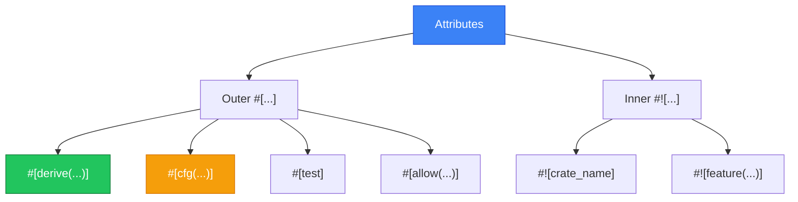

# Attributes

Attributes คือ metadata ที่ใช้กำหนดพฤติกรรมของ code!



---

## 1. Attribute Basics

### 1.1 Outer vs Inner Attributes

| Type | Syntax | Applies to |
|------|--------|------------|
| Outer | `#[attr]` | Item that follows |
| Inner | `#![attr]` | Enclosing item (crate/module) |

<RustPlayground>

```rust
// Inner attribute - applies to crate
#![allow(unused)]

// Outer attribute - applies to struct
#[derive(Debug)]
struct Person {
 name: String,
}

fn main() {
 let p = Person { name: String::from("Alice") };
 println!("{:?}", p);
}
```

</RustPlayground>

---

## 2. derive Attribute

### 2.1 Common Derives

<RustPlayground>

```rust
// Derive multiple traits
#[derive(Debug, Clone, PartialEq, Eq, Hash, Default)]
struct Point {
 x: i32,
 y: i32,
}

fn main() {
 let p1 = Point { x: 1, y: 2 };
 let p2 = p1.clone();
 
 // Debug
 println!("{:?}", p1);
 
 // PartialEq
 println!("p1 == p2: {}", p1 == p2);
 
 // Default
 let origin = Point::default();
 println!("Origin: {:?}", origin);
}
```

</RustPlayground>

### 2.2 Derivable Traits

| Trait | Description |
|-------|-------------|
| `Debug` | `{:?}` formatting |
| `Clone` | Deep copy with `.clone()` |
| `Copy` | Implicit copy (stack only) |
| `PartialEq` | `==` and `!=` |
| `Eq` | Reflexive equality |
| `PartialOrd` | `<`, `>`, `<=`, `>=` |
| `Ord` | Total ordering |
| `Hash` | Use in HashMap/HashSet |
| `Default` | Default value |

---

## 3. cfg Attribute (Conditional Compilation)

### 3.1 Platform-specific Code

<RustPlayground>

```rust
// Only compile on Windows
#[cfg(target_os = "windows")]
fn platform_specific() {
 println!("Running on Windows");
}

// Only compile on Linux/Mac
#[cfg(not(target_os = "windows"))]
fn platform_specific() {
 println!("Running on Unix-like system");
}

// Feature flags
#[cfg(feature = "advanced")]
fn advanced_feature() {
 println!("Advanced feature enabled");
}

fn main() {
 platform_specific();
}
```

</RustPlayground>

### 3.2 cfg_attr

<RustPlayground>

```rust
// Conditional derive
#[cfg_attr(feature = "serde", derive(Serialize, Deserialize))]
#[derive(Debug)]
struct Config {
 name: String,
 value: i32,
}

fn main() {
 let c = Config { 
 name: String::from("test"), 
 value: 42 
 };
 println!("{:?}", c);
}
```

</RustPlayground>

### 3.3 Common cfg Options

| Option | Description |
|--------|-------------|
| `target_os` | `"windows"`, `"linux"`, `"macos"` |
| `target_arch` | `"x86_64"`, `"aarch64"` |
| `feature` | Cargo features |
| `test` | Running tests |
| `debug_assertions` | Debug build |

---

## 4. allow, warn, deny

### 4.1 Lint Control

<RustPlayground>

```rust
// Allow unused variables in this function
#[allow(unused_variables)]
fn demo() {
 let x = 5; // No warning
}

// Deny unused imports in this module
#[deny(unused_imports)]
mod strict {
 // use std::io; // Would cause compile error!
}

// Warn on dead code
#[warn(dead_code)]
fn unused_function() {
 // Will show warning
}

fn main() {
 demo();
}
```

</RustPlayground>

### 4.2 Common Lints

| Lint | Description |
|------|-------------|
| `unused_variables` | Unused variables |
| `unused_imports` | Unused imports |
| `dead_code` | Unused functions/types |
| `unused_mut` | Unnecessary mut |
| `non_snake_case` | Naming convention |
| `clippy::*` | Clippy lints |

---

## 5. Function Attributes

### 5.1 Test Attributes

<RustPlayground>

```rust
fn add(a: i32, b: i32) -> i32 {
 a + b
}

#[cfg(test)]
mod tests {
 use super::*;
 
 #[test]
 fn test_add() {
 assert_eq!(add(2, 3), 5);
 }
 
 #[test]
 #[ignore]
 fn slow_test() {
 // Ignored unless --ignored flag
 }
 
 #[test]
 #[should_panic(expected = "divide by zero")]
 fn test_panic() {
 let _ = 1 / 0;
 }
}

fn main() {
 println!("2 + 3 = {}", add(2, 3));
}
```

</RustPlayground>

### 5.2 Other Function Attributes

| Attribute | Description |
|-----------|-------------|
| `#[inline]` | Hint to inline |
| `#[inline(always)]` | Force inline |
| `#[cold]` | Unlikely to be called |
| `#[must_use]` | Warn if result unused |
| `#[deprecated]` | Mark as deprecated |

<RustPlayground>

```rust
#[must_use = "this Result should be handled"]
fn important_operation() -> Result<(), String> {
 Ok(())
}

#[deprecated(since = "1.0.0", note = "use new_function instead")]
fn old_function() {
 println!("Old!");
}

#[inline]
fn fast_function(x: i32) -> i32 {
 x * 2
}

fn main() {
 let _ = important_operation(); // OK with let _
 // important_operation(); // Warning!
 
 println!("{}", fast_function(5));
}
```

</RustPlayground>

---

## 6. Struct/Enum Attributes

### 6.1 repr Attribute

<RustPlayground>

```rust
// C-compatible layout
#[repr(C)]
struct CStruct {
 a: u8,
 b: u32,
 c: u8,
}

// Specify size
#[repr(u8)]
enum Status {
 Active = 0,
 Inactive = 1,
 Pending = 2,
}

// Packed (no padding)
#[repr(packed)]
struct Packed {
 a: u8,
 b: u32,
}

fn main() {
 println!("CStruct size: {}", std::mem::size_of::<CStruct>());
 println!("Status size: {}", std::mem::size_of::<Status>());
}
```

</RustPlayground>

---

## 7. Module/Crate Attributes

### 7.1 Crate-level Attributes

```rust
// lib.rs or main.rs
#![allow(unused)]
#![warn(missing_docs)]
#![deny(unsafe_code)]

// Feature gates (nightly only)
#![feature(some_unstable_feature)]
```

### 7.2 Documentation Attributes

<RustPlayground>

```rust
/// This is a doc comment for the function
/// 
/// # Examples
/// 
/// ```
/// let result = add(2, 3);
/// assert_eq!(result, 5);
/// ```
pub fn add(a: i32, b: i32) -> i32 {
 a + b
}

#[doc = "This is an alternative way to write docs"]
pub fn subtract(a: i32, b: i32) -> i32 {
 a - b
}

fn main() {
 println!("{}", add(2, 3));
}
```

</RustPlayground>

---

## 8. สรุป

| Attribute | Description |
|-----------|-------------|
| `#[derive(...)]` | Auto-implement traits |
| `#[cfg(...)]` | Conditional compilation |
| `#[allow(...)]` | Suppress warnings |
| `#[deny(...)]` | Treat as error |
| `#[test]` | Mark as test |
| `#[inline]` | Inline hint |
| `#[must_use]` | Warn if unused |
| `#[deprecated]` | Mark deprecated |
| `#[repr(...)]` | Memory layout |!!!
| `#![...]` | Crate-level attribute |

---

[บทถัดไป: Type Conversions](/intermediate/conversions)
