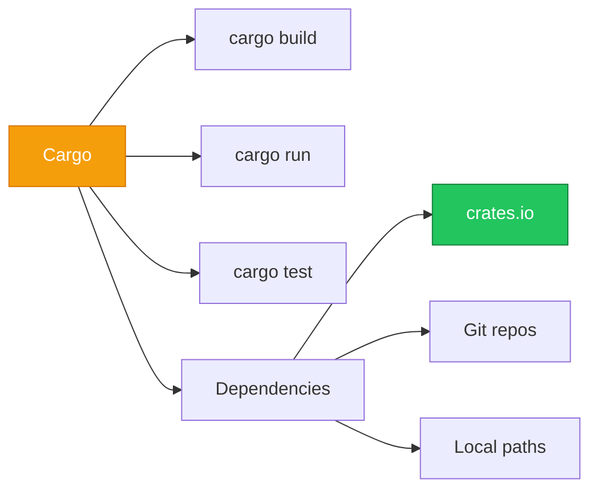

# Cargo & Dependencies

Cargo คือ package manager และ build system ของ Rust!



---

## 1. Cargo Basics

### 1.1 สร้างโปรเจกต์

```bash
# สร้าง binary project
cargo new my_project
cd my_project

# สร้าง library project
cargo new my_library --lib

# ดูโครงสร้าง
tree my_project
```

```
my_project/
├── Cargo.toml    # Package configuration
├── Cargo.lock    # Dependency lock file
└── src/
    └── main.rs   # Entry point (binary)
    # หรือ lib.rs (library)
```

### 1.2 คำสั่งพื้นฐาน

| Command | Description |
|---------|-------------|
| `cargo new` | สร้างโปรเจกต์ใหม่ |
| `cargo build` | Compile project |
| `cargo run` | Build และ run |
| `cargo test` | Run tests |
| `cargo check` | Check without building |
| `cargo clean` | ลบ build artifacts |

### 1.3 Build Modes

```bash
# Debug build (เร็วกว่า, ไม่ optimize)
cargo build

# Release build (ช้ากว่า, optimize)
cargo build --release

# Run release
cargo run --release
```

---

## 2. Cargo.toml

### 2.1 Basic Structure

```toml
[package]
name = "my_project"
version = "0.1.0"
edition = "2024"
authors = ["Your Name <you@example.com>"]
description = "A sample Rust project"
license = "MIT"
repository = "https://github.com/user/repo"
keywords = ["rust", "example"]

[dependencies]
# Dependencies go here

[dev-dependencies]
# Test/dev only dependencies

[build-dependencies]
# Build script dependencies
```

### 2.2 Common Fields

| Field | Description |
|-------|-------------|
| `name` | Package name |
| `version` | Semantic version (MAJOR.MINOR.PATCH) |
| `edition` | Rust edition (2024, 2021, 2018) |
| `authors` | Authors list |
| `description` | Short description |
| `license` | SPDX license identifier |
| `repository` | Git repository URL |
| `documentation` | Docs URL |
| `readme` | README file path |

---

## 3. Dependencies

### 3.1 Adding Dependencies

```toml
[dependencies]
# From crates.io with version
serde = "1.0"
tokio = "1"

# With features
serde = { version = "1.0", features = ["derive"] }

# From Git
my_crate = { git = "https://github.com/user/repo" }
my_crate = { git = "https://github.com/user/repo", branch = "main" }
my_crate = { git = "https://github.com/user/repo", tag = "v1.0" }
my_crate = { git = "https://github.com/user/repo", rev = "abc123" }

# From local path
my_local = { path = "../my_local_crate" }
```

### 3.2 Version Requirements

| Syntax | Meaning |
|--------|---------|
| `"1.0"` | `>=1.0.0, <2.0.0` (SemVer compatible) |
| `"1.2.3"` | `>=1.2.3, <2.0.0` |
| `"=1.2.3"` | Exactly 1.2.3 |
| `">=1.0"` | 1.0 or higher |
| `"<1.5"` | Less than 1.5 |
| `"1.0.*"` | Any 1.0.x version |
| `"~1.2"` | `>=1.2.0, <1.3.0` |

### 3.3 cargo add

```bash
# Add dependency
cargo add serde

# With features
cargo add serde --features derive

# Specific version
cargo add tokio@1.0

# Dev dependency
cargo add --dev pretty_assertions

# Remove dependency
cargo remove serde
```

### 3.4 Updating Dependencies

```bash
# Update to latest compatible versions
cargo update

# Update specific package
cargo update -p serde

# Show outdated packages
cargo outdated  # requires cargo-outdated
```

---

## 4. Features

### 4.1 Defining Features

```toml
[package]
name = "my_library"
version = "0.1.0"

[features]
# Default features
default = ["json"]

# Optional features
json = ["serde_json"]
async = ["tokio"]
full = ["json", "async"]

[dependencies]
serde = "1.0"

# Optional dependencies
serde_json = { version = "1.0", optional = true }
tokio = { version = "1", optional = true }
```

### 4.2 Using Features

```toml
# In dependent Cargo.toml
[dependencies]
my_library = { version = "1.0", features = ["json", "async"] }

# Disable default features
my_library = { version = "1.0", default-features = false, features = ["json"] }
```

### 4.3 Conditional Compilation

```rust
// In code
#[cfg(feature = "json")]
pub mod json_support {
    use serde_json::Value;
    
    pub fn parse(s: &str) -> Value {
        serde_json::from_str(s).unwrap()
    }
}

#[cfg(feature = "async")]
pub mod async_support {
    pub async fn fetch() -> String {
        "async result".to_string()
    }
}
```

---

## 5. Workspaces

### 5.1 Workspace Structure

```
my_workspace/
├── Cargo.toml        # Workspace root
├── crates/
│   ├── core/
│   │   ├── Cargo.toml
│   │   └── src/lib.rs
│   ├── cli/
│   │   ├── Cargo.toml
│   │   └── src/main.rs
│   └── web/
│       ├── Cargo.toml
│       └── src/main.rs
```

### 5.2 Workspace Cargo.toml

```toml
# Root Cargo.toml
[workspace]
members = [
    "crates/core",
    "crates/cli",
    "crates/web",
]

# Shared dependencies
[workspace.dependencies]
serde = "1.0"
tokio = "1"

# Package workspace settings
[workspace.package]
edition = "2024"
authors = ["Team <team@example.com>"]
license = "MIT"
```

### 5.3 Member Cargo.toml

```toml
[package]
name = "my-cli"
version = "0.1.0"
edition.workspace = true    # Inherit from workspace
authors.workspace = true
license.workspace = true

[dependencies]
my-core = { path = "../core" }
serde.workspace = true      # Use workspace version
```

---

## 6. Profiles

### 6.1 Built-in Profiles

| Profile | Use Case | Optimizations |
|---------|----------|---------------|
| `dev` | Development | None (fast compile) |
| `release` | Production | Full optimization |
| `test` | Testing | Like dev |
| `bench` | Benchmarks | Like release |

### 6.2 Custom Profiles

```toml
# Cargo.toml
[profile.dev]
opt-level = 0        # No optimization
debug = true         # Debug info

[profile.release]
opt-level = 3        # Maximum optimization
lto = true           # Link-time optimization
strip = true         # Strip symbols

[profile.dev.package."*"]
opt-level = 2        # Optimize dependencies in dev

# Custom profile
[profile.profiling]
inherits = "release"
debug = true         # Keep debug info for profiling
```

---

## 7. Cargo Tools

### 7.1 cargo clippy (Linting)

```bash
# Install
rustup component add clippy

# Run
cargo clippy

# Deny warnings
cargo clippy -- -D warnings

# Fix automatically
cargo clippy --fix
```

### 7.2 cargo fmt (Formatting)

```bash
# Install
rustup component add rustfmt

# Format all files
cargo fmt

# Check formatting (CI)
cargo fmt -- --check

# Config file: rustfmt.toml
```

```toml
# rustfmt.toml
max_width = 100
tab_spaces = 4
use_small_heuristics = "Default"
```

### 7.3 cargo doc (Documentation)

```bash
# Generate docs
cargo doc

# Open in browser
cargo doc --open

# Include private items
cargo doc --document-private-items

# With all dependencies
cargo doc --all
```

### 7.4 Other Useful Tools

| Tool | Description | Install |
|------|-------------|---------|
| `cargo-watch` | Auto-rebuild on change | `cargo install cargo-watch` |
| `cargo-edit` | Add/remove deps | `cargo install cargo-edit` |
| `cargo-outdated` | Check outdated deps | `cargo install cargo-outdated` |
| `cargo-audit` | Security vulnerabilities | `cargo install cargo-audit` |
| `cargo-expand` | Expand macros | `cargo install cargo-expand` |
| `cargo-tree` | Dependency tree | Built-in |

```bash
# Watch and run
cargo watch -x run

# Watch and test
cargo watch -x test

# Dependency tree
cargo tree

# Security audit
cargo audit
```

---

## 8. Publishing to crates.io

### 8.1 Preparation

```bash
# Login to crates.io
cargo login <your-api-token>

# Required in Cargo.toml:
# - name, version, license, description
# - repository or homepage

# Verify package
cargo publish --dry-run
cargo package --list  # List files
```

### 8.2 Publishing

```bash
# Publish
cargo publish

# Yank a version (remove from new deps)
cargo yank --version 1.0.0

# Un-yank
cargo yank --version 1.0.0 --undo
```

---

## 9. Best Practices

### 9.1 Cargo.toml Checklist

| Item | Recommendation |
|------|----------------|
| Edition | Use latest (`2024`) |
| Versions | Use SemVer (`"1.0"`) |
| Features | Disable unused |
| Profiles | Optimize for release |
| Locking | Commit `Cargo.lock` for binaries |

### 9.2 Dependency Management

| Do | Don't |
|----|-------|
| Use `cargo add` | Edit Cargo.toml manually |
| Pin exact versions in binaries | Use `*` wildcards |
| Review `cargo audit` | Ignore vulnerabilities |
| Regular `cargo update` | Let deps get stale |

---

## 10. สรุป

| Command | Description |
|---------|-------------|
| `cargo new` | Create project |
| `cargo build` | Compile |
| `cargo run` | Build and run |
| `cargo test` | Run tests |
| `cargo add` | Add dependency |
| `cargo clippy` | Linting |
| `cargo fmt` | Formatting |
| `cargo doc` | Generate docs |
| `cargo publish` | Publish to crates.io |

---

[บทถัดไป: Structs & Enums](/intermediate/structs)
