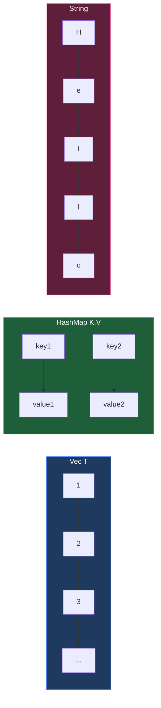

# Collections

Rust มี collections หลักๆ 3 ชนิดที่ใช้บ่อยมาก!



---

## 1. Vector (Vec)

### 1.1 สร้าง Vector

Dynamic array ที่ขยายได้

<RustPlayground>

```rust
fn main() {
 // สร้าง Vec ว่าง
 let mut v: Vec<i32> = Vec::new();
 
 // เพิ่มค่า
 v.push(1);
 v.push(2);
 v.push(3);
 println!("v: {:?}", v);
 
 // สร้างด้วย macro
 let v2 = vec![1, 2, 3, 4, 5];
 println!("v2: {:?}", v2);
 
 // เข้าถึงด้วย index
 println!("v2[0]: {}", v2[0]);
 
 // เข้าถึงแบบ safe
 match v2.get(100) {
 Some(val) => println!("Got: {}", val),
 None => println!("Index out of bounds"),
 }
}
```

</RustPlayground>

### Vec Methods

<RustPlayground>

```rust
fn main() {
 let mut v = vec![1, 2, 3, 4, 5];
 
 // Length
 println!("len: {}", v.len());
 println!("is_empty: {}", v.is_empty());
 
 // Add/Remove
 v.push(6);
 println!("after push: {:?}", v);
 
 let popped = v.pop();
 println!("popped: {:?}, vec: {:?}", popped, v);
 
 v.insert(0, 0); // insert at index
 println!("after insert: {:?}", v);
 
 v.remove(0); // remove at index
 println!("after remove: {:?}", v);
 
 // First and Last
 println!("first: {:?}", v.first());
 println!("last: {:?}", v.last());
 
 // Contains
 println!("contains 3: {}", v.contains(&3));
 
 // Sort
 let mut unsorted = vec![3, 1, 4, 1, 5, 9];
 unsorted.sort();
 println!("sorted: {:?}", unsorted);
 
 // Reverse
 unsorted.reverse();
 println!("reversed: {:?}", unsorted);
}
```

</RustPlayground>

### Iterating

<RustPlayground>

```rust
fn main() {
 let v = vec![1, 2, 3, 4, 5];
 
 // for loop (immutable)
 println!("Immutable iteration:");
 for i in &v {
 println!(" {}", i);
 }
 
 // for loop (mutable)
 let mut v2 = vec![1, 2, 3];
 println!("\nMutable iteration:");
 for i in &mut v2 {
 *i *= 2;
 }
 println!(" doubled: {:?}", v2);
 
 // Iterator methods
 let sum: i32 = v.iter().sum();
 println!("\nsum: {}", sum);
 
 let doubled: Vec<i32> = v.iter().map(|x| x * 2).collect();
 println!("doubled: {:?}", doubled);
 
 let evens: Vec<&i32> = v.iter().filter(|x| *x % 2 == 0).collect();
 println!("evens: {:?}", evens);
}
```

</RustPlayground>

## HashMap

Key-value pairs (dictionary)

<RustPlayground>

```rust
use std::collections::HashMap;

fn main() {
 // สร้าง HashMap
 let mut scores = HashMap::new();
 
 // เพิ่มค่า
 scores.insert(String::from("Blue"), 10);
 scores.insert(String::from("Yellow"), 50);
 
 println!("{:?}", scores);
 
 // เข้าถึงค่า
 let team = String::from("Blue");
 match scores.get(&team) {
 Some(score) => println!("{}: {}", team, score),
 None => println!("{} not found", team),
 }
 
 // หรือใช้ copied()
 let score = scores.get(&team).copied().unwrap_or(0);
 println!("Blue score: {}", score);
}
```

</RustPlayground>

### HashMap Methods

<RustPlayground>

```rust
use std::collections::HashMap;

fn main() {
 let mut map: HashMap<&str, i32> = HashMap::new();
 
 // Insert
 map.insert("a", 1);
 map.insert("b", 2);
 map.insert("c", 3);
 println!("map: {:?}", map);
 
 // Insert returns old value if key existed
 let old = map.insert("a", 100);
 println!("old value: {:?}", old);
 
 // entry API (insert if not exists)
 map.entry("d").or_insert(4); // insert 4 for "d"
 map.entry("a").or_insert(999); // "a" exists, so no change
 println!("after entry: {:?}", map);
 
 // Contains
 println!("contains 'b': {}", map.contains_key("b"));
 
 // Remove
 let removed = map.remove("b");
 println!("removed: {:?}", removed);
 
 // Iterate
 println!("\nIterating:");
 for (key, value) in &map {
 println!(" {}: {}", key, value);
 }
 
 // Keys and Values
 println!("keys: {:?}", map.keys().collect::<Vec<_>>());
 println!("values: {:?}", map.values().collect::<Vec<_>>());
}
```

</RustPlayground>

### Word Counter Example

<RustPlayground>

```rust
use std::collections::HashMap;

fn main() {
 let text = "hello world wonderful world hello rust hello";
 
 let mut word_count: HashMap<&str, i32> = HashMap::new();
 
 for word in text.split_whitespace() {
 let count = word_count.entry(word).or_insert(0);
 *count += 1;
 }
 
 println!("Word counts:");
 for (word, count) in &word_count {
 println!(" {}: {}", word, count);
 }
}
```

</RustPlayground>

::: recommendation
**ใช้ `entry` API เสมอ**
แทนที่จะเช็คว่ามี key ไหม (`contains_key`) แล้วค่อย insert ซึ่งต้อง hash key 2 รอบ
การใช้ `.entry(key).or_insert(val)` ทำงานรวดเดียวจบ เร็วกว่าและเขียนสั้นกว่า!
:::

## String

UTF-8 encoded text

<RustPlayground>

```rust
fn main() {
 // สร้าง String
 let s1 = String::new(); // empty
 let s2 = String::from("hello");
 let s3 = "hello".to_string();
 
 println!("s1: '{}', s2: '{}', s3: '{}'", s1, s2, s3);
 
 // Concatenation
 let mut hello = String::from("Hello");
 hello.push_str(", world"); // append &str
 hello.push('!'); // append char
 println!("hello: {}", hello);
 
 // Format macro (ดีกว่า +)
 let s = format!("{} - {} - {}", s2, s3, hello);
 println!("formatted: {}", s);
}
```

</RustPlayground>

### String vs &str

| | `String` | `&str` |
|---|----------|--------|
| Ownership | Owned | Borrowed |
| Mutability | Mutable | Immutable |
| Size | Dynamic | Fixed |
| Memory | Heap | Stack/Heap |
| ใช้เมื่อ | ต้องการเป็นเจ้าของ/แก้ไข | อ่านอย่างเดียว |

<RustPlayground>

```rust
fn main() {
 let owned: String = String::from("owned string");
 let borrowed: &str = "borrowed string";
 
 // &str จาก String
 let slice: &str = &owned;
 
 // String จาก &str
 let new_owned: String = borrowed.to_string();
 // หรือ
 let new_owned2: String = String::from(borrowed);
 
 println!("owned: {}", owned);
 println!("borrowed: {}", borrowed);
 println!("slice: {}", slice);
 println!("new_owned: {}", new_owned);
}
```

</RustPlayground>

### String Methods

<RustPlayground>

```rust
fn main() {
 let s = String::from("Hello, World!");
 
 // Length (bytes, not chars!)
 println!("len: {} bytes", s.len());
 
 // Character count
 println!("chars: {}", s.chars().count());
 
 // Case conversion
 println!("lower: {}", s.to_lowercase());
 println!("upper: {}", s.to_uppercase());
 
 // Trim
 let padded = " hello ";
 println!("trimmed: '{}'", padded.trim());
 
 // Contains
 println!("contains 'World': {}", s.contains("World"));
 
 // Replace
 println!("replaced: {}", s.replace("World", "Rust"));
 
 // Split
 let words: Vec<&str> = s.split(", ").collect();
 println!("split: {:?}", words);
 
 // Starts/Ends with
 println!("starts with 'Hello': {}", s.starts_with("Hello"));
 println!("ends with '!': {}", s.ends_with("!"));
}
```

</RustPlayground>

### Thai String Handling

<RustPlayground>

```rust
fn main() {
 let thai = "สวัสดี";
 
 // len() คือ bytes (UTF-8)
 println!("bytes: {}", thai.len()); // 18 bytes
 
 // chars().count() คือจำนวน Unicode code points
 println!("code points: {}", thai.chars().count()); // 6
 
 // ระวัง! ภาษาไทยมี combining characters
 println!("\nCharacters:");
 for (i, c) in thai.chars().enumerate() {
 println!(" {}: {} (U+{:04X})", i, c, c as u32);
 }
 
 // การ slice ต้องระวัง byte boundaries!
 // thai[0..1] จะ panic เพราะ "ส" ใช้ 3 bytes
 // ใช้ chars() แทน
 let first_char = thai.chars().next().unwrap();
 println!("\nFirst char: {}", first_char);
}
```

</RustPlayground>

::: pitfall
**อย่า Index String ด้วยตัวเลข!**
`s[0]` ใน Rust ถือว่าผิดกฎหมาย! เพราะ Rust String เป็น UTF-8 ซึ่ง 1 ตัวอักษรอาจใช้ 1-4 bytes
ถ้าอยากได้ตัวอักษรแรก ให้ใช้ `.chars().nth(0)` หรือถ้าอยาก slice byte range จริงๆ ต้องมั่นใจว่า range นั้นไม่ผ่ากลางตัวอักษร (ไม่งั้น panic)
:::

## เปรียบเทียบ Collections

| Collection | ข้อดี | ข้อเสีย | ใช้เมื่อ |
|------------|------|--------|---------|
| `Vec<T>` | Index เร็ว, ต่อท้ายเร็ว | Insert/remove ตรงกลางช้า | List ของข้อมูล |
| `HashMap<K,V>` | Lookup เร็ว | ไม่มีลำดับ | Key-value pairs |
| `String` | UTF-8, dynamic | Index by byte not char | Text |
| `VecDeque<T>` | Push/pop ทั้ง 2 ด้านเร็ว | Index ช้ากว่า Vec | Queue/Deque |
| `HashSet<T>` | Membership check เร็ว | ไม่มี value | Unique items |
| `BTreeMap<K,V>` | Sorted keys | ช้ากว่า HashMap | Sorted key-value |

## สรุป

| Type | สร้าง | เพิ่มค่า | เข้าถึง |
|------|------|---------|--------|
| `Vec<T>` | `vec![]` / `Vec::new()` | `.push()` | `v[i]` / `.get(i)` |
| `HashMap<K,V>` | `HashMap::new()` | `.insert(k,v)` | `.get(&k)` |
| `String` | `String::from()` | `.push_str()` | `.chars()` |

---

[บทถัดไป: Modules & Packages](./modules)
