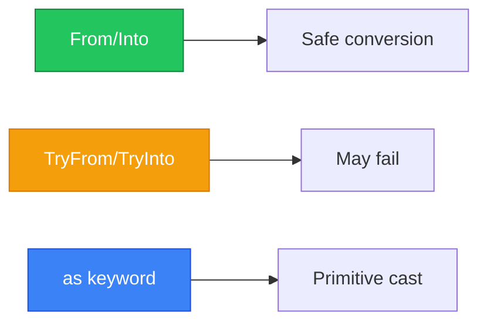

# Type Conversions

แปลงระหว่าง types ใน Rust!



---

## 1. From และ Into Traits

### 1.1 From Trait

<RustPlayground>

```rust
fn main() {
 // From<&str> for String
 let s: String = String::from("hello");
 println!("String: {}", s);
 
 // From<i32> for i64
 let num: i64 = i64::from(42i32);
 println!("i64: {}", num);
 
 // From<[T; N]> for Vec<T>
 let arr = [1, 2, 3];
 let vec: Vec<i32> = Vec::from(arr);
 println!("Vec: {:?}", vec);
}
```

</RustPlayground>

### 1.2 Into Trait

`Into` is automatically implemented when `From` is implemented:

<RustPlayground>

```rust
fn main() {
 // Into is the reverse of From
 let s: String = "hello".into();
 println!("String: {}", s);
 
 let num: i64 = 42i32.into();
 println!("i64: {}", num);
 
 // Useful in function arguments
 fn greet(name: impl Into<String>) {
 let name = name.into();
 println!("Hello, {}!", name);
 }
 
 greet("Alice"); // &str
 greet(String::from("Bob")); // String
}
```

</RustPlayground>

### 1.3 Implementing From

<RustPlayground>

```rust
#[derive(Debug)]
struct Celsius(f64);

#[derive(Debug)]
struct Fahrenheit(f64);

// Implement From<Fahrenheit> for Celsius
impl From<Fahrenheit> for Celsius {
 fn from(f: Fahrenheit) -> Self {
 Celsius((f.0 - 32.0) * 5.0 / 9.0)
 }
}

// Into<Celsius> is automatically implemented for Fahrenheit

fn main() {
 let f = Fahrenheit(212.0);
 
 // Using From
 let c1 = Celsius::from(Fahrenheit(32.0));
 println!("32°F = {:?}", c1);
 
 // Using Into
 let c2: Celsius = Fahrenheit(100.0).into();
 println!("100°F = {:?}", c2);
}
```

</RustPlayground>

---

## 2. TryFrom และ TryInto Traits

### 2.1 Fallible Conversion

<RustPlayground>

```rust
use std::convert::TryFrom;

fn main() {
 // TryFrom can fail
 let big: i64 = 1000;
 let small: Result<i32, _> = i32::try_from(big);
 println!("1000 as i32: {:?}", small); // Ok(1000)
 
 let too_big: i64 = 10_000_000_000;
 let result: Result<i32, _> = i32::try_from(too_big);
 println!("10B as i32: {:?}", result); // Err(...)
}
```

</RustPlayground>

### 2.2 Implementing TryFrom

<RustPlayground>

```rust
use std::convert::TryFrom;

#[derive(Debug)]
struct Percentage(u8);

#[derive(Debug)]
struct PercentageError;

impl TryFrom<i32> for Percentage {
 type Error = PercentageError;
 
 fn try_from(value: i32) -> Result<Self, Self::Error> {
 if value >= 0 && value <= 100 {
 Ok(Percentage(value as u8))
 } else {
 Err(PercentageError)
 }
 }
}

fn main() {
 let valid = Percentage::try_from(50);
 println!("50: {:?}", valid); // Ok(Percentage(50))
 
 let invalid = Percentage::try_from(150);
 println!("150: {:?}", invalid); // Err(PercentageError)
 
 // Using TryInto
 let p: Result<Percentage, _> = 75.try_into();
 println!("75: {:?}", p);
}
```

</RustPlayground>

---

## 3. as Keyword (Primitive Casting)

### 3.1 Numeric Casting

<RustPlayground>

```rust
fn main() {
 // Integer to integer
 let x: i32 = 1000;
 let y: i64 = x as i64; // Safe: larger type
 let z: i16 = x as i16; // May truncate!
 
 println!("i32: {}, i64: {}, i16: {}", x, y, z);
 
 // Float to integer (truncates)
 let f: f64 = 3.99;
 let i: i32 = f as i32;
 println!("3.99 as i32 = {}", i); // 3
 
 // Integer to float
 let n: i32 = 42;
 let f: f64 = n as f64;
 println!("42 as f64 = {}", f);
 
 // char to integer
 let c: char = 'A';
 let code: u32 = c as u32;
 println!("'A' as u32 = {}", code); // 65
}
```

</RustPlayground>

### 3.2 Pointer Casting

```rust
fn main() {
 let x: i32 = 42;
 let ptr: *const i32 = &x as *const i32;
 let addr: usize = ptr as usize;
 
 println!("Address: {:#x}", addr);
}
```

---

## 4. ToString และ FromStr

### 4.1 ToString

<RustPlayground>

```rust
fn main() {
 // Types implementing Display get ToString for free
 let n: i32 = 42;
 let s: String = n.to_string();
 println!("Number as string: '{}'", s);
 
 let b: bool = true;
 println!("Bool as string: '{}'", b.to_string());
 
 // Custom type
 struct Point { x: i32, y: i32 }
 
 impl std::fmt::Display for Point {
 fn fmt(&self, f: &mut std::fmt::Formatter) -> std::fmt::Result {
 write!(f, "({}, {})", self.x, self.y)
 }
 }
 
 let p = Point { x: 1, y: 2 };
 println!("Point: {}", p.to_string());
}
```

</RustPlayground>

### 4.2 FromStr

<RustPlayground>

```rust
use std::str::FromStr;

fn main() {
 // Parse string to number
 let n: i32 = "42".parse().unwrap();
 println!("Parsed: {}", n);
 
 // With explicit type
 let f = f64::from_str("3.14").unwrap();
 println!("Float: {}", f);
 
 // Handle errors
 let result: Result<i32, _> = "not a number".parse();
 match result {
 Ok(n) => println!("Got: {}", n),
 Err(e) => println!("Error: {}", e),
 }
}
```

</RustPlayground>

### 4.3 Implementing FromStr

<RustPlayground>

```rust
use std::str::FromStr;

#[derive(Debug)]
struct Point {
 x: i32,
 y: i32,
}

#[derive(Debug)]
struct ParsePointError;

impl FromStr for Point {
 type Err = ParsePointError;
 
 fn from_str(s: &str) -> Result<Self, Self::Err> {
 // Expected format: "x,y"
 let parts: Vec<&str> = s.split(',').collect();
 if parts.len() != 2 {
 return Err(ParsePointError);
 }
 
 let x = parts[0].trim().parse().map_err(|_| ParsePointError)?;
 let y = parts[1].trim().parse().map_err(|_| ParsePointError)?;
 
 Ok(Point { x, y })
 }
}

fn main() {
 let p: Point = "10, 20".parse().unwrap();
 println!("Point: {:?}", p);
 
 let invalid: Result<Point, _> = "invalid".parse();
 println!("Invalid: {:?}", invalid);
}
```

</RustPlayground>

---

## 5. AsRef และ AsMut

### 5.1 AsRef - Cheap Reference Conversion

<RustPlayground>

```rust
fn print_bytes(data: impl AsRef<[u8]>) {
 let bytes = data.as_ref();
 println!("Bytes: {:?}", bytes);
}

fn main() {
 // Works with &[u8]
 print_bytes(&[1, 2, 3]);
 
 // Works with Vec<u8>
 print_bytes(vec![4, 5, 6]);
 
 // Works with String (as bytes)
 print_bytes("hello");
}
```

</RustPlayground>

### 5.2 AsMut

<RustPlayground>

```rust
fn double_all(data: &mut impl AsMut<[i32]>) {
 for x in data.as_mut() {
 *x *= 2;
 }
}

fn main() {
 let mut v = vec![1, 2, 3];
 double_all(&mut v);
 println!("Doubled: {:?}", v);
 
 let mut arr = [4, 5, 6];
 double_all(&mut arr);
 println!("Doubled: {:?}", arr);
}
```

</RustPlayground>

---

## 6. Deref Coercion

<RustPlayground>

```rust
use std::ops::Deref;

fn main() {
 // String -> &str via Deref
 let s = String::from("hello");
 let len = string_length(&s); // Deref coercion!
 println!("Length: {}", len);
 
 // Box<T> -> &T via Deref
 let boxed = Box::new(5);
 let doubled = double(&boxed); // Deref coercion!
 println!("Doubled: {}", doubled);
}

fn string_length(s: &str) -> usize {
 s.len()
}

fn double(n: &i32) -> i32 {
 n * 2
}
```

</RustPlayground>

---

## 7. Comparison Table

| Method | Safe | May Fail | Use Case |
|--------|------|----------|----------|
| `From/Into` | Yes | No | Infallible conversion |
| `TryFrom/TryInto` | Yes | Yes | Fallible conversion |
| `as` | No | No | Primitive casting |
| `FromStr/parse()` | Yes | Yes | String parsing |
| `AsRef/AsMut` | Yes | No | Reference conversion |
| `Deref` | Yes | No | Smart pointer coercion |

---

## 8. สรุป

| Trait/Method | Description |
|--------------|-------------|
| `From<T>` | Convert from T (infallible) |
| `Into<T>` | Convert into T (auto-implemented) |
| `TryFrom<T>` | Convert from T (may fail) |
| `TryInto<T>` | Convert into T (may fail) |
| `as` | Primitive type casting |
| `FromStr` | Parse from string |
| `ToString` | Convert to String |
| `AsRef<T>` | Cheap reference conversion |
| `Deref` | Smart pointer coercion |

---

[บทถัดไป: Unsafe Rust](/advanced/unsafe)
