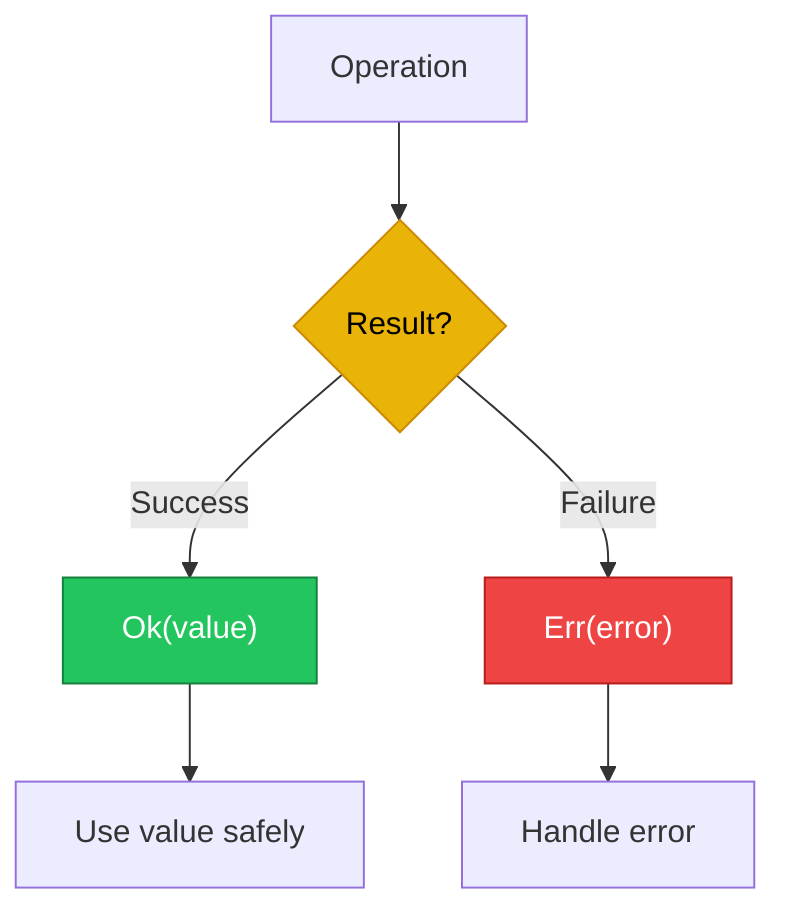

# Error Handling

เลิกกลัว Error ได้แล้ว! Rust มีวิธีจัดการ error ที่เจ๋งมาก ไม่มี exceptions แต่ใช้ `Result` และ `Option` แทน!

:::tip ทำไม Rust ไม่ใช้ Exception? 
เพราะ Exception ซ่อนตัวได้! คุณไม่รู้ว่า function ไหนจะ throw error ออกมา แต่ `Result` บังคับให้ handle error ทุกที่ = ปลอดภัยกว่า!
:::



---

## 1. Result Type

### 1.1 Result คืออะไร?

`Result<T, E>` เป็น enum ที่มี 2 variants:
- `Ok(T)` - สำเร็จ มีค่า
- `Err(E)` - ผิดพลาด มี error

<RustPlayground>

```rust
fn main() {
  // สร้าง Result ด้วย Ok และ Err
  let success: Result<i32, &str> = Ok(42);
  let failure: Result<i32, &str> = Err("something went wrong");
  
  // ตรวจสอบด้วย match
  match success {
    Ok(value) => println!("Success: {}", value),
    Err(e) => println!("Error: {}", e),
  }
  
  match failure {
    Ok(value) => println!("Success: {}", value),
    Err(e) => println!("Error: {}", e),
  }
}
```

</RustPlayground>

### 1.2 Result Definition

```rust
enum Result<T, E> {
  Ok(T), // T = type ของค่าสำเร็จ
  Err(E), // E = type ของ error
}
```

### 1.3 Real World Example

<RustPlayground>

```rust
use std::num::ParseIntError;

fn parse_number(s: &str) -> Result<i32, ParseIntError> {
  s.parse::<i32>()
}

fn main() {
  // กรณีสำเร็จ
  match parse_number("42") {
    Ok(n) => println!("Parsed: {}", n),
    Err(e) => println!("Error: {}", e),
  }
  
  // กรณีผิดพลาด
  match parse_number("hello") {
    Ok(n) => println!("Parsed: {}", n),
    Err(e) => println!("Error: {}", e),
  }
}
```

</RustPlayground>

---

## 2. Option Type

### 2.1 Option vs null

Rust ไม่มี `null` แต่ใช้ `Option<T>` แทน:

| | Rust Option | null (other languages) |
|---|-------------|------------------------|
| Type safety | Compile-time check | Runtime check |
| Must handle | Yes (compiler forces) | No (can forget) |
| NullPointerException | Impossible | Common bug |

### 2.2 Option Definition

```rust
enum Option<T> {
  Some(T), // มีค่า
  None, // ไม่มีค่า
}
```

### 2.3 Option Examples

<RustPlayground>

```rust
fn find_user(id: u32) -> Option<String> {
  match id {
    1 => Some(String::from("Alice")),
    2 => Some(String::from("Bob")),
    _ => None,
  }
}

fn main() {
  // Match Option
  match find_user(1) {
    Some(name) => println!("Found: {}", name),
    None => println!("User not found"),
  }
  
  match find_user(999) {
    Some(name) => println!("Found: {}", name),
    None => println!("User not found"),
  }
}
```

</RustPlayground>

---

## 3. unwrap และ expect

### 3.1 unwrap()

<RustPlayground>

```rust
fn main() {
  // unwrap: ถ้า Ok/Some ได้ค่า, ถ้า Err/None = panic!
  let value: Result<i32, &str> = Ok(42);
  println!("Value: {}", value.unwrap());
  
  let some_value: Option<i32> = Some(100);
  println!("Some: {}", some_value.unwrap());
  
  // DANGER! จะ panic
  // let bad: Result<i32, &str> = Err("oops");
  // bad.unwrap(); // panic!
}
```

</RustPlayground>

### 3.2 expect()

<RustPlayground>

```rust
fn main() {
  // expect: เหมือน unwrap แต่ใส่ message เอง
  let value: Result<i32, &str> = Ok(42);
  println!("Value: {}", value.expect("Should have value"));
  
  // ดีกว่า unwrap เพราะ message ชัดเจน
  // let bad: Result<i32, &str> = Err("oops");
  // bad.expect("Failed to get value");
  // panic: Failed to get value: "oops"
}
```

</RustPlayground>

### 3.3 เมื่อไหร่ควรใช้ unwrap/expect?

| ใช้ได้ | ไม่ควรใช้ |
|--------|----------|
| Tests | Production code |
| Prototypes | User input handling |
| 100% แน่ใจว่าไม่ fail | File/Network operations |

::: pitfall
**อย่าใช้ `unwrap` ใน Library Code!**
ถ้าคุณเขียน Library ให้คนอื่นใช้ ห้าม panic เด็ดขาด (ยกเว้นเรื่องความปลอดภัยร้ายแรง) ควร return `Result` ให้คนเรียกตัดสินใจเอง
:::

---

## 4. ? Operator (Propagation)

### 4.1 ? Operator คืออะไร?

`?` ทำให้ propagate error ขึ้นไปง่ายขึ้น:

```rust
// แบบยาว (ไม่ใช้ ?)
let value = match result {
  Ok(v) => v,
  Err(e) => return Err(e),
};

// แบบสั้น (ใช้ ?)
let value = result?;
```

### 4.2 ตัวอย่างการใช้ ?

<RustPlayground>

```rust
use std::num::ParseIntError;

fn add_strings(a: &str, b: &str) -> Result<i32, ParseIntError> {
  let num_a: i32 = a.parse()?; // ถ้า error จะ return Err ทันที
  let num_b: i32 = b.parse()?;
  Ok(num_a + num_b)
}

fn main() {
  match add_strings("10", "20") {
    Ok(sum) => println!("Sum: {}", sum),
    Err(e) => println!("Error: {}", e),
  }
  
  match add_strings("10", "abc") {
    Ok(sum) => println!("Sum: {}", sum),
    Err(e) => println!("Error: {}", e),
  }
}
```

</RustPlayground>

### 4.3 ? ใน main()

<RustPlayground>

```rust
use std::num::ParseIntError;

fn main() -> Result<(), ParseIntError> {
  let n: i32 = "42".parse()?;
  println!("n = {}", n);
  Ok(())
}
```

</RustPlayground>

---

## 5. Combinators

### 5.1 map()

แปลงค่าข้างใน Ok/Some:

<RustPlayground>

```rust
fn main() {
  let result: Result<i32, &str> = Ok(5);
  let doubled = result.map(|x| x * 2);
  println!("{:?}", doubled); // Ok(10)
  
  let option: Option<i32> = Some(5);
  let doubled = option.map(|x| x * 2);
  println!("{:?}", doubled); // Some(10)
}
```

</RustPlayground>

### 5.2 and_then() (flatMap)

<RustPlayground>

```rust
fn main() {
  fn double_if_positive(x: i32) -> Option<i32> {
    if x > 0 { Some(x * 2) } else { None }
  }
  
  let result = Some(5).and_then(double_if_positive);
  println!("{:?}", result); // Some(10)
  
  let result = Some(-5).and_then(double_if_positive);
  println!("{:?}", result); // None
}
```

</RustPlayground>

### 5.3 unwrap_or() และ unwrap_or_else()

<RustPlayground>

```rust
fn main() {
  // unwrap_or: ใช้ default value
  let value: Option<i32> = None;
  println!("{}", value.unwrap_or(0)); // 0
  
  // unwrap_or_else: ใช้ closure
  let result: Result<i32, &str> = Err("error");
  let value = result.unwrap_or_else(|e| {
    println!("Error occurred: {}", e);
    -1
  });
  println!("Value: {}", value); // -1
}
```

</RustPlayground>

### 5.4 Combinator Summary

| Method | Description |
|--------|-------------|
| `map()` | Transform inner value |
| `and_then()` | Chain operations |
| `unwrap_or()` | Default value |
| `unwrap_or_else()` | Default with closure |
| `ok_or()` | `Option` to `Result` |
| `ok()` | `Result` to `Option` |

---

## 6. Custom Error Types

### 6.1 Simple Error Enum

<RustPlayground>

```rust
#[derive(Debug)]
enum AppError {
  NotFound,
  InvalidInput(String),
  IoError(String),
}

fn find_user(id: i32) -> Result<String, AppError> {
  match id {
    1 => Ok(String::from("Alice")),
    2 => Ok(String::from("Bob")),
    x if x < 0 => Err(AppError::InvalidInput(format!("Invalid ID: {}", x))),
    _ => Err(AppError::NotFound),
  }
}

fn main() {
  match find_user(1) {
    Ok(name) => println!("Found: {}", name),
    Err(e) => println!("Error: {:?}", e),
  }
  
  match find_user(-5) {
    Ok(name) => println!("Found: {}", name),
    Err(e) => println!("Error: {:?}", e),
  }
}
```

</RustPlayground>

### 6.2 Implementing Display

<RustPlayground>

```rust
use std::fmt;

#[derive(Debug)]
enum AppError {
  NotFound,
  InvalidInput(String),
}

impl fmt::Display for AppError {
  fn fmt(&self, f: &mut fmt::Formatter) -> fmt::Result {
    match self {
      AppError::NotFound => write!(f, "Item not found"),
      AppError::InvalidInput(msg) => write!(f, "Invalid input: {}", msg),
    }
  }
}

fn main() {
  let error = AppError::InvalidInput(String::from("negative number"));
  println!("Debug: {:?}", error);
  println!("Display: {}", error);
}
```

</RustPlayground>

::: best-practice
**ใช้ `thiserror` หรือ `anyhow` ในโปรเจกต์จริง**
การเขียน `impl Display` และ `impl Error` เองนั้นเสียเวลามาก ในงานจริงเรานิยมใช้ crate `thiserror` สำหรับ Library และ `anyhow` สำหรับ Application
:::

---

## 7. panic! และ recoverable errors

### 7.1 panic! คืออะไร?

`panic!` หยุดโปรแกรมทันที (unrecoverable error):

<RustPlayground>

```rust
fn main() {
  // panic!("Something went terribly wrong!");
  
  // Array bounds checking
  let v = vec![1, 2, 3];
  // v[99]; // panic: index out of bounds
  
  println!("This prints if no panic");
}
```

</RustPlayground>

### 7.2 เมื่อไหร่ใช้ panic?

| ใช้ panic | ใช้ Result |
|-----------|-----------|
| Bug ใน code | Expected errors |
| Invariant violated | User input errors |
| Contract broken | File/Network errors |
| Tests | Recoverable situations |

---

## 8. Best Practices

### 8.1 Error Handling Checklist

| Practice | Description |
|----------|-------------|
| Use `Result` | For recoverable errors |
| Use `Option` | When value may not exist |
| Use `?` | For clean error propagation |
| Custom errors | For domain-specific errors |
| `expect()` over `unwrap()` | Better error messages |
| Never `unwrap()` user input | Always validate |

### 8.2 Comparison with Other Languages

| Rust | Java | Go | Python |
|------|------|-----|--------|
| `Result<T, E>` | `try-catch` | `(value, error)` | `try-except` |
| `?` operator | - | `if err != nil` | - |
| Compile-time | Runtime | Manual check | Runtime |

---

## 9. สรุป

| Concept | Description | Example |
|---------|-------------|---------|
| `Result<T, E>` | Success or Error | `Ok(42)` / `Err("fail")` |
| `Option<T>` | Some or None | `Some(42)` / `None` |
| `unwrap()` | Get value or panic | `result.unwrap()` |
| `expect()` | unwrap with message | `result.expect("msg")` |
| `?` | Propagate error | `value?` |
| `map()` | Transform value | `result.map(|x| x * 2)` |
| `and_then()` | Chain operations | `opt.and_then(f)` |

---

[บทถัดไป: Collections](/intermediate/collections)
