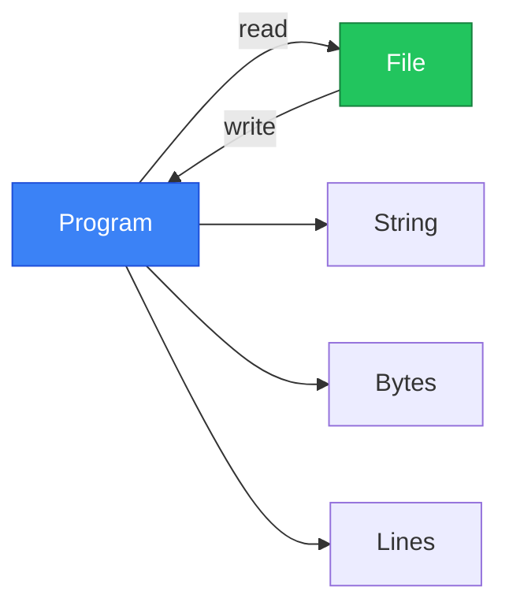

# File I/O

อ่านและเขียนไฟล์ใน Rust!



---

## 1. Reading Files

### 1.1 Read Entire File to String

<RustPlayground>

```rust
use std::fs;

fn main() {
 // วิธีง่ายที่สุด - อ่านทั้งไฟล์เป็น String
 // (ใน Playground ใช้ตัวอย่าง)
 let content = "Hello, World!\nLine 2\nLine 3";
 
 // ในโค้ดจริง:
 // let content = fs::read_to_string("hello.txt")
 // .expect("Could not read file");
 
 println!("File content:\n{}", content);
}
```

</RustPlayground>

### 1.2 Read with Error Handling

```rust
use std::fs;
use std::io;

fn read_file(path: &str) -> Result<String, io::Error> {
 fs::read_to_string(path)
}

fn main() {
 match read_file("config.txt") {
 Ok(content) => println!("Content: {}", content),
 Err(e) => eprintln!("Error reading file: {}", e),
 }
}
```

### 1.3 Read to Bytes

```rust
use std::fs;

fn main() -> std::io::Result<()> {
 // อ่านเป็น bytes (สำหรับ binary files)
 let bytes = fs::read("image.png")?;
 println!("File size: {} bytes", bytes.len());
 Ok(())
}
```

---

## 2. Writing Files

### 2.1 Write String to File

<RustPlayground>

```rust
fn main() {
 // ในโค้ดจริง:
 // use std::fs;
 // fs::write("output.txt", "Hello, World!")
 // .expect("Could not write file");
 
 let content = "Hello, World!";
 println!("Would write: {}", content);
}
```

</RustPlayground>

### 2.2 Write with Error Handling

```rust
use std::fs;
use std::io;

fn write_file(path: &str, content: &str) -> Result<(), io::Error> {
 fs::write(path, content)
}

fn main() {
 match write_file("output.txt", "Hello, Rust!") {
 Ok(()) => println!("File written successfully!"),
 Err(e) => eprintln!("Error writing file: {}", e),
 }
}
```

### 2.3 Write Bytes

```rust
use std::fs;

fn main() -> std::io::Result<()> {
 let data: Vec<u8> = vec![0x48, 0x65, 0x6c, 0x6c, 0x6f]; // "Hello"
 fs::write("binary.dat", &data)?;
 Ok(())
}
```

---

## 3. File Handle (Buffered I/O)

### 3.1 BufReader (Reading)

```rust
use std::fs::File;
use std::io::{BufReader, BufRead};

fn main() -> std::io::Result<()> {
 let file = File::open("data.txt")?;
 let reader = BufReader::new(file);
 
 // อ่านทีละบรรทัด
 for line in reader.lines() {
 let line = line?;
 println!("{}", line);
 }
 
 Ok(())
}
```

### 3.2 BufWriter (Writing)

```rust
use std::fs::File;
use std::io::{BufWriter, Write};

fn main() -> std::io::Result<()> {
 let file = File::create("output.txt")?;
 let mut writer = BufWriter::new(file);
 
 writeln!(writer, "Line 1")?;
 writeln!(writer, "Line 2")?;
 writeln!(writer, "Line 3")?;
 
 // Flush เพื่อให้แน่ใจว่าเขียนเสร็จ
 writer.flush()?;
 
 Ok(())
}
```

---

## 4. File Operations

### 4.1 Open Modes

```rust
use std::fs::{File, OpenOptions};
use std::io::Write;

fn main() -> std::io::Result<()> {
 // Read only
 let _file = File::open("input.txt")?;
 
 // Create new (or truncate existing)
 let _file = File::create("output.txt")?;
 
 // Append mode
 let mut file = OpenOptions::new()
 .append(true)
 .create(true)
 .open("log.txt")?;
 
 writeln!(file, "New log entry")?;
 
 Ok(())
}
```

### 4.2 OpenOptions

| Method | Description |
|--------|-------------|
| `.read(true)` | Open for reading |
| `.write(true)` | Open for writing |
| `.append(true)` | Append to file |
| `.create(true)` | Create if not exists |
| `.truncate(true)` | Truncate file |

---

## 5. Path Operations

### 5.1 Path and PathBuf

<RustPlayground>

```rust
use std::path::{Path, PathBuf};

fn main() {
 // Path (borrowed) vs PathBuf (owned)
 let path = Path::new("/home/user/file.txt");
 
 println!("File name: {:?}", path.file_name());
 println!("Extension: {:?}", path.extension());
 println!("Parent: {:?}", path.parent());
 println!("Exists: {}", path.exists());
 
 // PathBuf - สร้าง path ใหม่
 let mut path_buf = PathBuf::from("/home/user");
 path_buf.push("documents");
 path_buf.push("file.txt");
 println!("PathBuf: {:?}", path_buf);
}
```

</RustPlayground>

### 5.2 Path Methods

| Method | Description |
|--------|-------------|
| `.exists()` | File/dir exists? |
| `.is_file()` | Is a file? |
| `.is_dir()` | Is a directory? |
| `.file_name()` | Get filename |
| `.extension()` | Get extension |
| `.parent()` | Get parent directory |
| `.join("path")` | Join paths |

---

## 6. Directory Operations

### 6.1 List Directory

```rust
use std::fs;

fn main() -> std::io::Result<()> {
 // List files in directory
 for entry in fs::read_dir(".")? {
 let entry = entry?;
 let path = entry.path();
 
 if path.is_file() {
 println!("File: {:?}", path);
 } else if path.is_dir() {
 println!("Dir: {:?}", path);
 }
 }
 
 Ok(())
}
```

### 6.2 Create/Remove Directories

```rust
use std::fs;

fn main() -> std::io::Result<()> {
 // Create directory
 fs::create_dir("new_folder")?;
 
 // Create nested directories
 fs::create_dir_all("parent/child/grandchild")?;
 
 // Remove empty directory
 fs::remove_dir("new_folder")?;
 
 // Remove directory with contents
 fs::remove_dir_all("parent")?;
 
 Ok(())
}
```

### 6.3 File Operations

```rust
use std::fs;

fn main() -> std::io::Result<()> {
 // Copy file
 fs::copy("source.txt", "destination.txt")?;
 
 // Rename/Move file
 fs::rename("old_name.txt", "new_name.txt")?;
 
 // Remove file
 fs::remove_file("unwanted.txt")?;
 
 // Get file metadata
 let metadata = fs::metadata("file.txt")?;
 println!("Size: {} bytes", metadata.len());
 println!("Is file: {}", metadata.is_file());
 
 Ok(())
}
```

---

## 7. Practical Examples

### 7.1 Config File Reader

<RustPlayground>

```rust
use std::collections::HashMap;

fn parse_config(content: &str) -> HashMap<String, String> {
 let mut config = HashMap::new();
 
 for line in content.lines() {
 let line = line.trim();
 
 // Skip comments and empty lines
 if line.is_empty() || line.starts_with('#') {
 continue;
 }
 
 // Parse key=value
 if let Some(pos) = line.find('=') {
 let key = line[..pos].trim().to_string();
 let value = line[pos + 1..].trim().to_string();
 config.insert(key, value);
 }
 }
 
 config
}

fn main() {
 let content = r#"
# Database config
host = localhost
port = 5432
database = myapp
"#;
 
 let config = parse_config(content);
 
 for (key, value) in &config {
 println!("{} = {}", key, value);
 }
}
```

</RustPlayground>

### 7.2 Simple Logger

```rust
use std::fs::OpenOptions;
use std::io::Write;
use chrono::Local;

fn log(message: &str) -> std::io::Result<()> {
 let mut file = OpenOptions::new()
 .create(true)
 .append(true)
 .open("app.log")?;
 
 let timestamp = Local::now().format("%Y-%m-%d %H:%M:%S");
 writeln!(file, "[{}] {}", timestamp, message)?;
 
 Ok(())
}

fn main() {
 log("Application started").unwrap();
 log("Processing data...").unwrap();
 log("Application finished").unwrap();
}
```

### 7.3 CSV Reader

<RustPlayground>

```rust
fn main() {
 let csv_data = r#"name,age,city
Alice,30,Bangkok
Bob,25,Chiang Mai
Charlie,35,Phuket"#;
 
 let lines: Vec<&str> = csv_data.lines().collect();
 let headers: Vec<&str> = lines[0].split(',').collect();
 
 println!("Headers: {:?}\n", headers);
 
 for line in &lines[1..] {
 let values: Vec<&str> = line.split(',').collect();
 
 for (header, value) in headers.iter().zip(values.iter()) {
 println!("{}: {}", header, value);
 }
 println!("---");
 }
}
```

</RustPlayground>

---

## 8. Error Handling Patterns

### 8.1 Using ? Operator

```rust
use std::fs;
use std::io;

fn process_file(path: &str) -> Result<String, io::Error> {
 let content = fs::read_to_string(path)?;
 let processed = content.to_uppercase();
 Ok(processed)
}
```

### 8.2 Custom Error Type

```rust
use std::fs;
use std::io;

#[derive(Debug)]
enum FileError {
 NotFound,
 PermissionDenied,
 Other(String),
}

impl From<io::Error> for FileError {
 fn from(err: io::Error) -> Self {
 match err.kind() {
 io::ErrorKind::NotFound => FileError::NotFound,
 io::ErrorKind::PermissionDenied => FileError::PermissionDenied,
 _ => FileError::Other(err.to_string()),
 }
 }
}

fn read_config(path: &str) -> Result<String, FileError> {
 Ok(fs::read_to_string(path)?)
}
```

---

## 9. สรุป

| Function | Description |
|----------|-------------|
| `fs::read_to_string()` | Read file to String |
| `fs::read()` | Read file to bytes |
| `fs::write()` | Write to file |
| `File::open()` | Open for reading |
| `File::create()` | Create for writing |
| `BufReader` | Buffered reading |
| `BufWriter` | Buffered writing |
| `fs::read_dir()` | List directory |
| `fs::create_dir()` | Create directory |
| `fs::copy()` | Copy file |
| `fs::rename()` | Move/rename file |
| `fs::remove_file()` | Delete file |

---

[บทถัดไป: Modules & Packages](/intermediate/modules)
