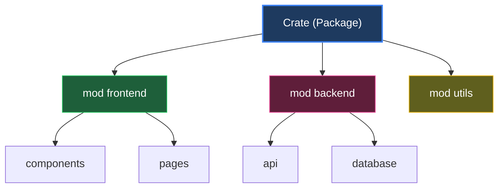

# Modules & Packages

จัดระเบียบโค้ดให้เป็นระบบ!



---

## 1. โครงสร้าง Rust Project

### 1.1 Directory Structure

```
my_project/
├── Cargo.toml          # Package config
├── Cargo.lock          # Dependencies lock
└── src/
    ├── main.rs         # Binary crate root
    ├── lib.rs          # Library crate root (optional)
    └── modules/        # Submodules
```

---

## 2. Module Basics

### 2.1 ประกาศ Module

<RustPlayground>

```rust
// ประกาศ module
mod greetings {
    // items ใน module เป็น private by default
    fn private_hello() {
        println!("This is private");
    }
    
    // ใช้ pub เพื่อให้เข้าถึงจากข้างนอกได้
    pub fn public_hello() {
        println!("Hello from greetings module!");
        // สามารถเรียก private function ภายใน module ได้
        private_hello();
    }
    
    pub fn greet(name: &str) {
        println!("Hello, {}!", name);
    }
}

fn main() {
    // เรียกใช้ function ใน module
    greetings::public_hello();
    greetings::greet("Ferris");
    
    // ERROR: greetings::private_hello(); // private!
}
```

</RustPlayground>

## Nested Modules

<RustPlayground>

```rust
mod outer {
    pub mod inner {
        pub fn function() {
            println!("outer::inner::function()");
        }
        
        pub fn super_function() {
            // super = parent module
            super::outer_function();
        }
    }
    
    pub fn outer_function() {
        println!("outer::outer_function()");
    }
}

fn main() {
    outer::inner::function();
    outer::outer_function();
    outer::inner::super_function();
}
```

</RustPlayground>

## use Keyword

<RustPlayground>

```rust
mod colors {
    pub fn red() -> &'static str { "red" }
    pub fn blue() -> &'static str { "blue" }
    pub fn green() -> &'static str { "green" }
}

// นำชื่อเข้ามาใน scope
use colors::red;

// นำหลายชื่อ
use colors::{blue, green};

fn main() {
    println!("{}", red());      // ไม่ต้อง colors::
    println!("{}", blue());
    println!("{}", green());
}
```

</RustPlayground>

### use with Aliases

<RustPlayground>

```rust
mod math {
    pub fn add(a: i32, b: i32) -> i32 { a + b }
}

mod string_math {
    pub fn add(a: &str, b: &str) -> String {
        format!("{}{}", a, b)
    }
}

// ใช้ as เพื่อตั้งชื่อใหม่
use math::add as int_add;
use string_math::add as str_add;

fn main() {
    println!("{}", int_add(1, 2));
    println!("{}", str_add("hello", "world"));
}
```

</RustPlayground>

## Visibility (pub)

<RustPlayground>

```rust
mod outer {
    pub mod inner {
        // pub: เข้าถึงได้จากทุกที่
        pub fn public_func() {
            println!("public");
        }
        
        // private: เข้าถึงได้เฉพาะใน module นี้
        fn private_func() {
            println!("private");
        }
        
        // pub(crate): เข้าถึงได้ภายใน crate เท่านั้น
        pub(crate) fn crate_func() {
            println!("crate only");
        }
        
        // pub(super): เข้าถึงได้จาก parent module
        pub(super) fn parent_func() {
            println!("parent only");
        }
    }
    
    pub fn call_inner() {
        inner::public_func();
        inner::crate_func();
        inner::parent_func();
    }
}

fn main() {
    outer::inner::public_func();
    outer::inner::crate_func();
    // inner::parent_func();  // ERROR: not accessible
    
    outer::call_inner();
}
```

</RustPlayground>

### Visibility Summary

| Visibility | เข้าถึงได้จาก |
|------------|-------------|
| (default) private | เฉพาะ module เดียวกัน |
| `pub` | ทุกที่ |
| `pub(crate)` | ภายใน crate |
| `pub(super)` | parent module |
| `pub(in path)` | path ที่กำหนด |

## Structs และ Visibility

<RustPlayground>

```rust
mod animal {
    pub struct Dog {
        pub name: String,      // public field
        age: u32,              // private field
    }
    
    impl Dog {
        pub fn new(name: &str, age: u32) -> Dog {
            Dog {
                name: String::from(name),
                age,
            }
        }
        
        pub fn get_age(&self) -> u32 {
            self.age
        }
    }
}

fn main() {
    let dog = animal::Dog::new("Buddy", 3);
    
    println!("Name: {}", dog.name);       // OK: public field
    // println!("Age: {}", dog.age);      // ERROR: private field
    println!("Age: {}", dog.get_age());   // OK: public method
}
```

</RustPlayground>

## File Structure

### แยก Module เป็นไฟล์

```
src/
├── main.rs
├── greetings.rs      # mod greetings
└── greetings/
    └── formal.rs     # mod greetings::formal
```

**main.rs:**
```rust
mod greetings;  // ดึงจาก greetings.rs หรือ greetings/mod.rs

fn main() {
    greetings::hello();
    greetings::formal::hello();
}
```

**greetings.rs:**
```rust
pub mod formal;  // ดึงจาก greetings/formal.rs

pub fn hello() {
    println!("Hello!");
}
```

**greetings/formal.rs:**
```rust
pub fn hello() {
    println!("Good morning, sir!");
}
```

## Crate Types

| Type | รายละเอียด | Entry Point |
|------|------------|-------------|
| Binary | โปรแกรมที่รันได้ | `src/main.rs` |
| Library | Code สำหรับใช้ซ้ำ | `src/lib.rs` |

## Re-exports

<RustPlayground>

```rust
mod internal {
    pub mod deep {
        pub fn useful_function() {
            println!("Very useful!");
        }
    }
}

// Re-export เพื่อให้เข้าถึงง่ายขึ้น
pub use internal::deep::useful_function;

fn main() {
    // แทนที่จะเรียก internal::deep::useful_function()
    useful_function();
}
```

</RustPlayground>

## External Crates

```toml
# Cargo.toml
[dependencies]
serde = "1.0"
rand = "0.8"
```

```rust
// main.rs
use serde::Serialize;
use rand::Rng;

fn main() {
    let mut rng = rand::thread_rng();
    let n: u32 = rng.gen_range(1..100);
    println!("Random: {}", n);
}
```

## The Prelude

Standard Library items ที่ import อัตโนมัติ:

| Item | Type |
|------|------|
| `std::option::Option` | Enum |
| `std::result::Result` | Enum |
| `std::string::String` | Struct |
| `std::vec::Vec` | Struct |
| `std::clone::Clone` | Trait |
| `std::marker::Copy` | Trait |

## สรุป

| Keyword | ใช้ทำอะไร |
|---------|----------|
| `mod` | ประกาศ module |
| `pub` | ทำให้ public |
| `use` | นำเข้า scope |
| `as` | ตั้งชื่อใหม่ |
| `self` | module ปัจจุบัน |
| `super` | parent module |
| `crate` | crate root |

---

[บทถัดไป: Traits & Generics](./traits)
