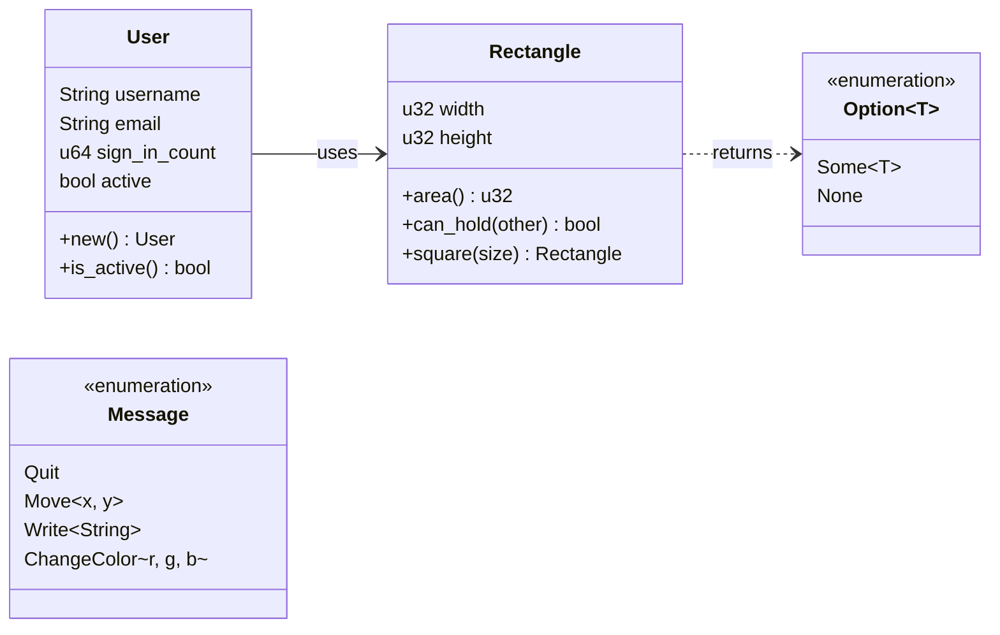

# Structs & Enums

สร้าง custom data types ของเราเอง!



## Structs

Struct คือการรวมหลาย fields เข้าด้วยกัน เหมือน Object ในภาษาอื่น

### Basic Struct

<RustPlayground>

```rust
// ประกาศ struct
struct User {
 username: String,
 email: String,
 sign_in_count: u64,
 active: bool,
}

fn main() {
 // สร้าง instance
 let user1 = User {
 email: String::from("someone@example.com"),
 username: String::from("someusername123"),
 active: true,
 sign_in_count: 1,
 };
 
 println!("Username: {}", user1.username);
 println!("Email: {}", user1.email);
 
 // Mutable struct
 let mut user2 = User {
 email: String::from("another@example.com"),
 username: String::from("anotherusername"),
 active: true,
 sign_in_count: 1,
 };
 
 user2.email = String::from("newemail@example.com");
 println!("New email: {}", user2.email);
}
```

</RustPlayground>

### Struct Update Syntax

<RustPlayground>

```rust
struct User {
 username: String,
 email: String,
 sign_in_count: u64,
 active: bool,
}

fn main() {
 let user1 = User {
 email: String::from("someone@example.com"),
 username: String::from("someusername123"),
 active: true,
 sign_in_count: 1,
 };
 
 // สร้าง user2 โดย copy บางส่วนจาก user1
 let user2 = User {
 email: String::from("another@example.com"),
 ..user1 // ใช้ค่าที่เหลือจาก user1
 };
 
 println!("user2 email: {}", user2.email);
 println!("user2 username: {}", user2.username);
}
```

</RustPlayground>

### Tuple Structs

<RustPlayground>

```rust
// Tuple struct - ไม่มีชื่อ field
struct Color(i32, i32, i32);
struct Point(i32, i32, i32);

fn main() {
 let black = Color(0, 0, 0);
 let origin = Point(0, 0, 0);
 
 // เข้าถึงด้วย index
 println!("Black: R={}, G={}, B={}", black.0, black.1, black.2);
 
 // destructuring
 let Point(x, y, z) = origin;
 println!("Origin: ({}, {}, {})", x, y, z);
}
```

</RustPlayground>

### Unit-Like Structs

<RustPlayground>

```rust
// Struct ไม่มี fields (ใช้กับ traits)
struct AlwaysEqual;

fn main() {
 let subject = AlwaysEqual;
 println!("Created unit struct!");
}
```

</RustPlayground>

### Methods

<RustPlayground>

```rust
#[derive(Debug)]
struct Rectangle {
 width: u32,
 height: u32,
}

impl Rectangle {
 // Method: &self = immutable reference to self
 fn area(&self) -> u32 {
 self.width * self.height
 }
 
 // Method กับ parameters
 fn can_hold(&self, other: &Rectangle) -> bool {
 self.width > other.width && self.height > other.height
 }
 
 // Associated function (ไม่มี self) - เหมือน static method
 fn square(size: u32) -> Rectangle {
 Rectangle {
 width: size,
 height: size,
 }
 }
}

fn main() {
 let rect1 = Rectangle { width: 30, height: 50 };
 let rect2 = Rectangle { width: 10, height: 40 };
 let square = Rectangle::square(25);
 
 println!("rect1: {:?}", rect1);
 println!("Area: {}", rect1.area());
 println!("Can rect1 hold rect2? {}", rect1.can_hold(&rect2));
 println!("Square: {:?}", square);
}
```

</RustPlayground>

### เปรียบเทียบ Struct vs Class

| Feature | Rust Struct | Java/C# Class |
|---------|-------------|---------------|
| Data | fields | fields |
| Methods | impl block | in class body |
| Constructor | Associated function | constructor |
| Inheritance | ไม่มี (ใช้ traits) | มี |
| Default visibility | private | package/public |

## Enums

Enum คือ type ที่มีได้หลาย variants

### Basic Enum

<RustPlayground>

```rust
#[derive(Debug)]
enum IpAddrKind {
 V4,
 V6,
}

fn main() {
 let four = IpAddrKind::V4;
 let six = IpAddrKind::V6;
 
 println!("IPv4: {:?}", four);
 println!("IPv6: {:?}", six);
 
 route(four);
 route(six);
}

fn route(ip_kind: IpAddrKind) {
 match ip_kind {
 IpAddrKind::V4 => println!("Routing IPv4..."),
 IpAddrKind::V6 => println!("Routing IPv6..."),
 }
}
```

</RustPlayground>

### Enums with Data

<RustPlayground>

```rust
#[derive(Debug)]
enum IpAddr {
 V4(u8, u8, u8, u8), // เก็บ 4 ตัวเลข
 V6(String), // เก็บ string
}

#[derive(Debug)]
enum Message {
 Quit, // ไม่มีข้อมูล
 Move { x: i32, y: i32 }, // struct-like
 Write(String), // String
 ChangeColor(i32, i32, i32), // tuple
}

fn main() {
 let home = IpAddr::V4(127, 0, 0, 1);
 let loopback = IpAddr::V6(String::from("::1"));
 
 println!("Home: {:?}", home);
 println!("Loopback: {:?}", loopback);
 
 let messages = [
 Message::Quit,
 Message::Move { x: 10, y: 20 },
 Message::Write(String::from("hello")),
 Message::ChangeColor(255, 0, 0),
 ];
 
 for msg in &messages {
 process_message(msg);
 }
}

fn process_message(msg: &Message) {
 match msg {
 Message::Quit => println!("Quit!"),
 Message::Move { x, y } => println!("Move to ({}, {})", x, y),
 Message::Write(text) => println!("Write: {}", text),
 Message::ChangeColor(r, g, b) => println!("Color: RGB({}, {}, {})", r, g, b),
 }
}
```

</RustPlayground>

### Enum Methods

<RustPlayground>

```rust
#[derive(Debug)]
enum Message {
 Write(String),
 Move { x: i32, y: i32 },
}

impl Message {
 fn call(&self) {
 match self {
 Message::Write(text) => println!("Writing: {}", text),
 Message::Move { x, y } => println!("Moving to ({}, {})", x, y),
 }
 }
}

fn main() {
 let msg = Message::Write(String::from("hello"));
 msg.call();
 
 let move_msg = Message::Move { x: 10, y: 20 };
 move_msg.call();
}
```

</RustPlayground>

## Option Enum

Rust ไม่มี `null` แต่ใช้ `Option<T>` แทน!

<RustPlayground>

```rust
fn main() {
 // Option มี 2 variants: Some(value) และ None
 let some_number: Option<i32> = Some(5);
 let no_number: Option<i32> = None;
 
 println!("some_number: {:?}", some_number);
 println!("no_number: {:?}", no_number);
 
 // ใช้ match จัดการ Option
 match some_number {
 Some(n) => println!("Got number: {}", n),
 None => println!("No number"),
 }
 
 // ใช้ if let
 if let Some(n) = some_number {
 println!("Number is: {}", n);
 }
 
 // Methods ที่มีประโยชน์
 println!("unwrap_or: {}", no_number.unwrap_or(0));
 println!("is_some: {}", some_number.is_some());
 println!("is_none: {}", no_number.is_none());
}
```

</RustPlayground>

### เปรียบเทียบ Option vs null

| | Rust Option | null (other languages) |
|---|-------------|------------------------|
| ต้อง handle | ใช่ (compiler บังคับ) | ไม่ (runtime error) |
| Type safety | Yes | No |
| Explicit | Yes | No |
| NullPointerException | ไม่มี | มี |

<RustPlayground>

```rust
fn divide(a: f64, b: f64) -> Option<f64> {
 if b == 0.0 {
 None // แทน null/exception
 } else {
 Some(a / b)
 }
}

fn main() {
 match divide(10.0, 2.0) {
 Some(result) => println!("10 / 2 = {}", result),
 None => println!("Cannot divide by zero!"),
 }
 
 match divide(10.0, 0.0) {
 Some(result) => println!("Result: {}", result),
 None => println!("Cannot divide by zero!"),
 }
}
```

</RustPlayground>

## สรุป

| Concept | คืออะไร | ใช้เมื่อ |
|---------|--------|---------|
| Struct | รวม fields หลายตัว | Object/Record |
| Tuple Struct | Struct แบบไม่มีชื่อ field | Type alias |
| Enum | หลาย variants | State/Type |
| Option | Some หรือ None | อาจมีหรือไม่มีค่า |

---

[บทถัดไป: Error Handling](./error-handling)
