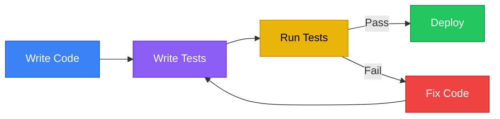
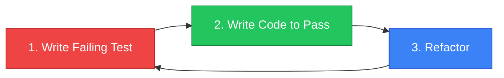

# Testing

เขียน tests เพื่อให้มั่นใจว่าโค้ดทำงานถูกต้อง!



---

## 1. Unit Tests

### 1.1 Test พื้นฐาน

<RustPlayground>

```rust
// ฟังก์ชันที่จะ test
fn add(a: i32, b: i32) -> i32 {
 a + b
}

fn multiply(a: i32, b: i32) -> i32 {
 a * b
}

// Test module
#[cfg(test)]
mod tests {
 use super::*; // นำเข้าทุกอย่างจาก parent module
 
 #[test]
 fn test_add() {
 assert_eq!(add(2, 3), 5);
 assert_eq!(add(-1, 1), 0);
 assert_eq!(add(0, 0), 0);
 }
 
 #[test]
 fn test_multiply() {
 assert_eq!(multiply(2, 3), 6);
 assert_eq!(multiply(-2, 3), -6);
 }
}

fn main() {
 println!("2 + 3 = {}", add(2, 3));
 println!("2 * 3 = {}", multiply(2, 3));
}
```

</RustPlayground>

### 1.2 Test Attributes

| Attribute | Description |
|-----------|-------------|
| `#[test]` | Mark function as test |
| `#[ignore]` | Skip this test |
| `#[should_panic]` | Test should panic |
| `#[cfg(test)]` | Only compile for tests |

### 1.3 Running Tests

```bash
# Run all tests
cargo test

# Run specific test
cargo test test_add

# Run tests with output
cargo test -- --nocapture

# Run ignored tests
cargo test -- --ignored

# Run tests in parallel (default) or single-threaded
cargo test -- --test-threads=1
```

---

## 2. Assertions

### 2.1 assert! Macros

<RustPlayground>

```rust
#[cfg(test)]
mod tests {
 #[test]
 fn test_assertions() {
 // assert! - ตรวจสอบ boolean
 assert!(true);
 assert!(1 + 1 == 2);
 
 // assert_eq! - ตรวจสอบเท่ากัน
 assert_eq!(2 + 2, 4);
 
 // assert_ne! - ตรวจสอบไม่เท่ากัน
 assert_ne!(2 + 2, 5);
 }
 
 #[test]
 fn test_with_message() {
 let result = 2 + 2;
 assert_eq!(result, 4, "Math is broken! {} != 4", result);
 }
}

fn main() {
 println!("Run with: cargo test");
}
```

</RustPlayground>

### 2.2 Assertion Summary

| Macro | Usage |
|-------|-------|
| `assert!(expr)` | True/False check |
| `assert_eq!(a, b)` | Equality check |
| `assert_ne!(a, b)` | Inequality check |
| `debug_assert!()` | Only in debug mode |

---

## 3. Testing Panics

### 3.1 should_panic

<RustPlayground>

```rust
fn divide(a: i32, b: i32) -> i32 {
 if b == 0 {
 panic!("Division by zero!");
 }
 a / b
}

#[cfg(test)]
mod tests {
 use super::*;
 
 #[test]
 #[should_panic]
 fn test_divide_by_zero() {
 divide(10, 0); // Should panic
 }
 
 #[test]
 #[should_panic(expected = "Division by zero")]
 fn test_divide_by_zero_message() {
 divide(10, 0); // Check panic message
 }
 
 #[test]
 fn test_divide_normal() {
 assert_eq!(divide(10, 2), 5);
 }
}

fn main() {
 println!("10 / 2 = {}", divide(10, 2));
}
```

</RustPlayground>

---

## 4. Result in Tests

### 4.1 Test with Result

<RustPlayground>

```rust
use std::num::ParseIntError;

fn parse_number(s: &str) -> Result<i32, ParseIntError> {
 s.parse()
}

#[cfg(test)]
mod tests {
 use super::*;
 
 // Test that returns Result
 #[test]
 fn test_parse_valid() -> Result<(), ParseIntError> {
 let n = parse_number("42")?;
 assert_eq!(n, 42);
 Ok(())
 }
 
 #[test]
 fn test_parse_invalid() {
 let result = parse_number("not a number");
 assert!(result.is_err());
 }
}

fn main() {
 println!("{:?}", parse_number("42"));
}
```

</RustPlayground>

---

## 5. Test Organization

### 5.1 Unit Tests Structure

```rust
// src/lib.rs
pub fn add(a: i32, b: i32) -> i32 {
 a + b
}

// Tests อยู่ในไฟล์เดียวกับ code
#[cfg(test)]
mod tests {
 use super::*;
 
 #[test]
 fn it_works() {
 assert_eq!(add(2, 2), 4);
 }
}
```

### 5.2 Integration Tests

```
my_project/
 src/
 lib.rs
 tests/ # Integration tests folder
 integration_test.rs
```

```rust
// tests/integration_test.rs
use my_project::add; // Use public API

#[test]
fn test_add_integration() {
 assert_eq!(add(2, 3), 5);
}
```

::: best-practice
**Integration Test = ผู้ใช้งานจริง**
โค้ดใน `tests/` จะถูกมองว่าเป็น "Crate ภายนอก" ดังนั้นจะเรียกใช้ได้เฉพาะ `pub` Items เท่านั้น นี่คือการจำลองการใช้งานจริงที่ดีที่สุด!
:::

::: tip แยก Unit vs Integration
*   **Unit Tests** (`src/*.rs`): Test logic เล็กๆ, private functions.
*   **Integration Tests** (`tests/*.rs`): Test การทำงานร่วมกันของ modules, public API usage.
:::

### 5.3 Test Private Functions

<RustPlayground>

```rust
fn private_helper(x: i32) -> i32 {
 x * 2
}

pub fn public_function(x: i32) -> i32 {
 private_helper(x) + 1
}

#[cfg(test)]
mod tests {
 use super::*;
 
 // สามารถ test private functions ได้!
 #[test]
 fn test_private_helper() {
 assert_eq!(private_helper(5), 10);
 }
 
 #[test]
 fn test_public_function() {
 assert_eq!(public_function(5), 11);
 }
}

fn main() {
 println!("{}", public_function(5));
}
```

</RustPlayground>

---

## 6. Test Fixtures

### 6.1 Setup and Teardown

<RustPlayground>

```rust
struct TestDatabase {
 data: Vec<String>,
}

impl TestDatabase {
 fn new() -> Self {
 println!("Setting up database...");
 TestDatabase { data: vec![] }
 }
 
 fn insert(&mut self, value: &str) {
 self.data.push(value.to_string());
 }
 
 fn count(&self) -> usize {
 self.data.len()
 }
}

impl Drop for TestDatabase {
 fn drop(&mut self) {
 println!("Cleaning up database...");
 }
}

#[cfg(test)]
mod tests {
 use super::*;
 
 #[test]
 fn test_insert() {
 let mut db = TestDatabase::new(); // Setup
 db.insert("hello");
 db.insert("world");
 assert_eq!(db.count(), 2);
 } // Teardown (Drop)
}

fn main() {
 let mut db = TestDatabase::new();
 db.insert("test");
 println!("Count: {}", db.count());
}
```

</RustPlayground>

---

## 7. Common Patterns

### 7.1 Test-Driven Development (TDD)



### 7.2 Property-Based Testing

```toml
# Cargo.toml
[dev-dependencies]
proptest = "1.0"
```

```rust
use proptest::prelude::*;

proptest! {
 #[test]
 fn test_add_commutative(a in 0..1000i32, b in 0..1000i32) {
 assert_eq!(add(a, b), add(b, a));
 }
}
```

---

## 8. Best Practices

### 8.1 Testing Checklist

| Practice | Description |
|----------|-------------|
| One assertion per test | Clear failure messages |
| Descriptive test names | `test_login_with_invalid_password` |
| Test edge cases | Empty, null, boundary values |
| Avoid test interdependence | Tests should be independent |
| Use fixtures for setup | DRY principle |

### 8.2 Test Naming Convention

```rust
#[test]
fn function_name_scenario_expected_behavior() {
 // test_add_two_positive_numbers_returns_sum
 // test_divide_by_zero_panics
 // test_parse_empty_string_returns_error
}
```

---

## 9. สรุป

| Concept | Description |
|---------|-------------|
| `#[test]` | Mark test function |
| `#[cfg(test)]` | Test module |
| `assert!` | Boolean assertion |
| `assert_eq!` | Equality assertion |
| `#[should_panic]` | Expect panic |
| `cargo test` | Run tests |
| `tests/` | Integration tests |

---

[บทถัดไป: Iterators & Closures](/intermediate/iterators)
